# 2021 Research Log

## 2021/12/28

Implementation of multi-threads Dijkstra's algorithm:

```c++
#include <iostream>
#include <fstream>
#include <map>
#include <vector>
#include <tuple>
#include <string>
#include <queue>
#include <stack>
#include <thread>
#include <mutex>
#include <chrono>

class Graph {
    int V, E;
    std::map<int, std::vector<std::tuple<int, int, int>>> G;
public:
    bool input_graph(std::string path) {
        std::ifstream file;
        file.open(path, std::ios::in);
        if (!file.is_open())
            return false;
        file >> V;
        file >> E;
        for (int i = 0; i < E; ++i) {
            int u, v, w;
            file >> u >> v >> w;
            G[u].push_back(std::make_tuple(u, v, w));
        }
        return true;
    }
    void show_graph() {
        for (int v = 0; v < V; ++v) {
            std::cout << v << " : ";
            for (auto i = G[v].begin(); i != G[v].end(); ++i)
                std::cout << std::get<0>(*i) << "-(" << std::get<2>(*i) << ")->" << std::get<1>(*i) << "  ";
            std::cout << std::endl;
        }
    }
    int vertices() {
        return V;
    }
    std::vector<std::tuple<int, int, int>> &edges(int v) {
        return G[v];
    }
};

// Dijkstra
class Dijkstra {
protected:
    Graph G;
    int s;
    int *distTo = nullptr;
    int *edgeTo = nullptr;
    std::chrono::time_point<std::chrono::steady_clock> _start, _end;
    std::chrono::duration<double> diff;
    static bool relax(Dijkstra &D, std::tuple<int, int, int> e, int &r) {
        int u = std::get<0>(e);
        int v = std::get<1>(e);
        int w = std::get<2>(e);
        if (D.distTo[v] > D.distTo[u] + w) {
            D.distTo[v] = D.distTo[u] + w;
            D.edgeTo[v] = u;
            r = v;
            return true;
        }
        return false;
    }
    void start() {
        _start = std::chrono::steady_clock::now();
    }
    void end() {
        _end = std::chrono::steady_clock::now();
        diff = _end - _start;
    }
public:
    static const int INFINITY = 99999;
    Dijkstra(Graph &G, int s): G(G), s(s) {
        distTo = new int[G.vertices()];
        edgeTo = new int[G.vertices()];
        _start = std::chrono::steady_clock::now();
        _end = _start;
    }
    ~Dijkstra() {
        delete [] distTo;
        delete [] edgeTo;
    }
    void run() {
        start();
        for (int v = 0; v < G.vertices(); ++v)
            distTo[v] = INFINITY;
        distTo[s] = 0;
        auto dist_greater = [&](const int &i, const int &j) -> bool { return distTo[i] > distTo[j]; };
        std::priority_queue<int, std::vector<int>, decltype(dist_greater)> minHeap(dist_greater);
        minHeap.push(s);
        while (!minHeap.empty()) {
            int v = minHeap.top();
            minHeap.pop();
            auto edges = G.edges(v);
            for (auto i = edges.begin(); i != edges.end(); ++i) {
                int r;
                if (relax(*this, *i, r))
                    minHeap.push(r);
            }
        }
        end();
    }
    void result() {
        std::cout << "Source: " << s << std::endl;
        for (int i = 0; i < G.vertices(); ++i) {
            std::cout << s << "-(" << distTo[i] << ")->" << i << " : ";
            std::stack<int> path;
            for (int j = i; j != s; j = edgeTo[j])
                path.push(j);
            path.push(s);
            while (!path.empty()) {
                std::cout << path.top() << " ";
                path.pop();
            }
            std::cout << std::endl;
        }
    }
    void time() {
        std::cout << "Time: " << diff.count() << std::endl;
    }
};

class MultiDijkstra : Dijkstra {
    int threads;
    std::map<int, std::vector<int>> R;
    static void multi_relax(MultiDijkstra &D, std::vector<std::tuple<int, int, int>> &edges, int id) {
        int e = edges.size();
        for (int i = id; i < e; i += D.threads) {
            int r;
            if (relax(D, edges[i], r))
                D.R[id].push_back(r);
        }
    }
public:
    MultiDijkstra(Graph &G, int s): Dijkstra(G, s) {}
    void run() {
        start();
        for (int v = 0; v < G.vertices(); ++v)
            distTo[v] = INFINITY;
        distTo[s] = 0;
        auto dist_greater = [&](const int &i, const int &j) -> bool { return distTo[i] > distTo[j]; };
        std::priority_queue<int, std::vector<int>, decltype(dist_greater)> minHeap(dist_greater);
        minHeap.push(s);
        while (!minHeap.empty()) {
            int v = minHeap.top();
            minHeap.pop();
            auto edges = G.edges(v);
            threads = 16;
            std::thread t0(multi_relax, std::ref(*this), std::ref(edges), 0);
            std::thread t1(multi_relax, std::ref(*this), std::ref(edges), 1);
            std::thread t2(multi_relax, std::ref(*this), std::ref(edges), 2);
            std::thread t3(multi_relax, std::ref(*this), std::ref(edges), 3);
            std::thread t4(multi_relax, std::ref(*this), std::ref(edges), 4);
            std::thread t5(multi_relax, std::ref(*this), std::ref(edges), 5);
            std::thread t6(multi_relax, std::ref(*this), std::ref(edges), 6);
            std::thread t7(multi_relax, std::ref(*this), std::ref(edges), 7);
            std::thread t8(multi_relax, std::ref(*this), std::ref(edges), 8);
            std::thread t9(multi_relax, std::ref(*this), std::ref(edges), 9);
            std::thread t10(multi_relax, std::ref(*this), std::ref(edges), 10);
            std::thread t11(multi_relax, std::ref(*this), std::ref(edges), 11);
            std::thread t12(multi_relax, std::ref(*this), std::ref(edges), 12);
            std::thread t13(multi_relax, std::ref(*this), std::ref(edges), 13);
            std::thread t14(multi_relax, std::ref(*this), std::ref(edges), 14);
            std::thread t15(multi_relax, std::ref(*this), std::ref(edges), 15);
            t0.join();
            t1.join();
            t2.join();
            t3.join();
            t4.join();
            t5.join();
            t6.join();
            t7.join();
            t8.join();
            t9.join();
            t10.join();
            t11.join();
            t12.join();
            t13.join();
            t14.join();
            t15.join();
            for (int i = 0; i < threads; ++i) {
                auto r = R[i];
                for (auto ii = r.begin(); ii != r.end(); ++ii)
                    minHeap.push(*ii);
                R[i].clear();
            }
        }
        end();
    }
    void result() {
        Dijkstra::result();
    }
    void time() {
        Dijkstra::time();
    }
};

// Main
int main(int argc, char *argv[])
{
    if (argc == 2) {
        Graph G;
        G.input_graph(std::string(argv[1]));
        // G.show_graph();
        // Dijkstra D(G, 0);
        // D.run();
        // D.result();
        // D.time();
        MultiDijkstra MD(G, 0);
        MD.run();
        // MD.result();
        MD.time();
    }
    return 0;
}
```

[Code is here](./code/dijkstra20211228.cpp)

Benchmark:

* different vertices (dense graph):

| thread | vertices | edges    | time       |
| ------ | -------- | -------- | ---------- |
| 1      | 100      | 9700     | 0.00127348 |
| 1      | 1000     | 997000   | 0.113473   |
| 1      | 2000     | 3994000  | 0.475336   |
| 1      | 3000     | 8991000  | 1.0961     |
| 1      | 5000     | 24985000 | 3.05482    |
| 1      | 10000    | 99970000 | 12.3187    |

| thread | vertices | edges    | time     |
| ------ | -------- | -------- | -------- |
| 2      | 100      | 9700     | 0.01428  |
| 2      | 1000     | 997000   | 0.184609 |
| 2      | 2000     | 3994000  | 0.48463  |
| 2      | 3000     | 8991000  | 0.939515 |
| 2      | 5000     | 24985000 | 2.17869  |
| 2      | 10000    | 99970000 | 7.36178  |

| thread | vertices | edges    | time      |
| ------ | -------- | -------- | --------- |
| 4      | 100      | 9700     | 0.0225974 |
| 4      | 1000     | 997000   | 0.258103  |
| 4      | 2000     | 3994000  | 0.597188  |
| 4      | 3000     | 8991000  | 1.03137   |
| 4      | 5000     | 24985000 | 2.23292   |
| 4      | 10000    | 99970000 | 6.78344   |

| thread | vertices | edges    | time      |
| ------ | -------- | -------- | --------- |
| 8      | 100      | 9700     | 0.0403934 |
| 8      | 1000     | 997000   | 0.449122  |
| 8      | 2000     | 3994000  | 1.00705   |
| 8      | 3000     | 8991000  | 1.70238   |
| 8      | 5000     | 24985000 | 3.12613   |
| 8      | 10000    | 99970000 | 8.41562   |

| thread | vertices | edges    | time      |
| ------ | -------- | -------- | --------- |
| 16     | 100      | 9700     | 0.0824203 |
| 16     | 1000     | 997000   | 0.830101  |
| 16     | 2000     | 3994000  | 1.86829   |
| 16     | 3000     | 8991000  | 2.85646   |
| 16     | 5000     | 24985000 | 5.56944   |
| 16     | 10000    | 99970000 | 12.5164   |

Under the same number of threads, as the number of vertices increases, the trend of time consumed: (1 thread as an example)

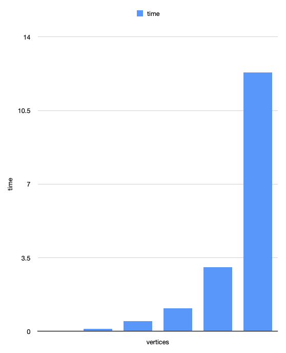

Under the same number of vertices, as the number of thread increases, the trend of time consumed:

100 vertices:

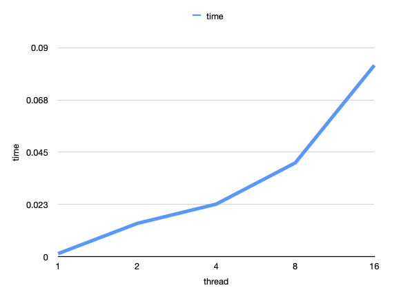

1000 vertices:

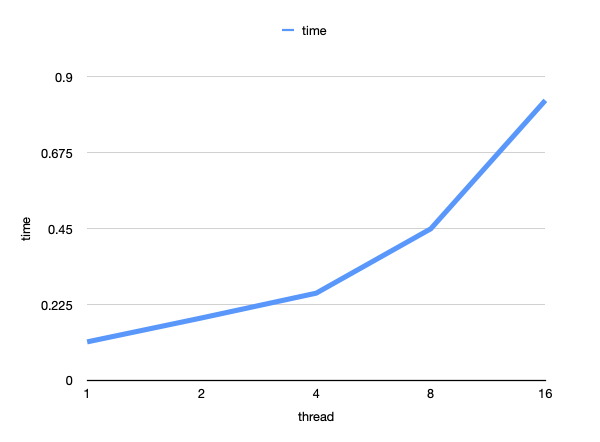

2000 vertices:

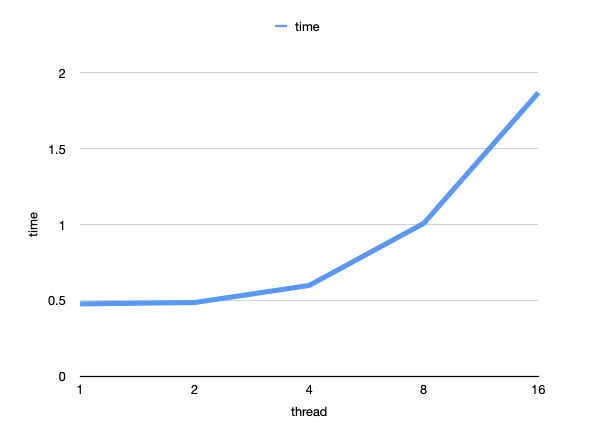

3000 vertices:

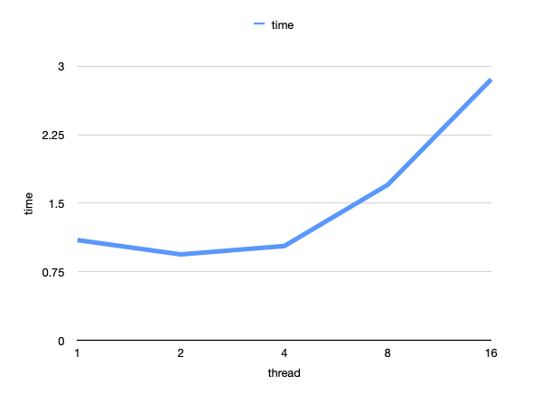

5000 vertices:

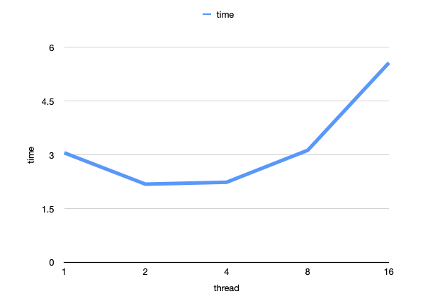

10000 vertices:

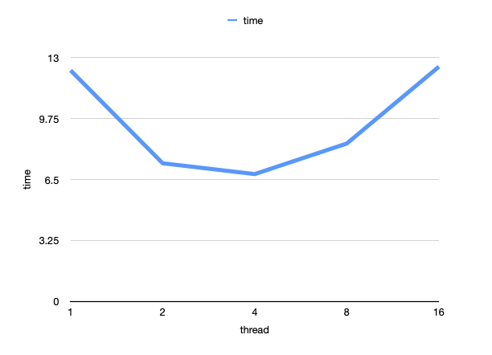

* different vertices (sparse graph):

| thread | vertices | edges | time        |
| ------ | -------- | ----- | ----------- |
| 1      | 100      | 500   | 0.000192729 |
| 1      | 1000     | 5000  | 0.00190588  |
| 1      | 2000     | 10000 | 0.00392891  |
| 1      | 3000     | 15000 | 0.00600173  |
| 1      | 5000     | 25000 | 0.0104799   |
| 1      | 10000    | 50000 | 0.0223921   |

| thread | vertices | edges | time       |
| ------ | -------- | ----- | ---------- |
| 2      | 100      | 500   | 0.00557169 |
| 2      | 1000     | 5000  | 0.0587796  |
| 2      | 2000     | 10000 | 0.11639    |
| 2      | 3000     | 15000 | 0.177096   |
| 2      | 5000     | 25000 | 0.285564   |
| 2      | 10000    | 50000 | 0.587261   |

| thread | vertices | edges | time      |
| ------ | -------- | ----- | --------- |
| 4      | 100      | 500   | 0.0091935 |
| 4      | 1000     | 5000  | 0.0954938 |
| 4      | 2000     | 10000 | 0.193999  |
| 4      | 3000     | 15000 | 0.296847  |
| 4      | 5000     | 25000 | 0.477253  |
| 4      | 10000    | 50000 | 0.950599  |

| thread | vertices | edges | time      |
| ------ | -------- | ----- | --------- |
| 8      | 100      | 500   | 0.0170947 |
| 8      | 1000     | 5000  | 0.178605  |
| 8      | 2000     | 10000 | 0.358013  |
| 8      | 3000     | 15000 | 0.527698  |
| 8      | 5000     | 25000 | 0.870299  |
| 8      | 10000    | 50000 | 1.79757   |

| thread | vertices | edges | time      |
| ------ | -------- | ----- | --------- |
| 16     | 100      | 500   | 0.0344511 |
| 16     | 1000     | 5000  | 0.370043  |
| 16     | 2000     | 10000 | 0.708161  |
| 16     | 3000     | 15000 | 1.10981   |
| 16     | 5000     | 25000 | 1.77584   |
| 16     | 10000    | 50000 | 3.63745   |

Under the same number of vertices, as the number of thread increases, the trend of time consumed: (10000 vertices as an example)

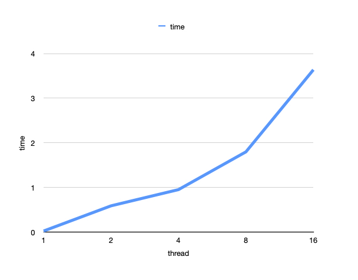

* different edges:

**number of vertices: 10000**

| thread | edges    | time        |
| ------ | -------- | ----------- |
| 1      | 10000    | 0.000052708 |
| 1      | 20000    | 0.0114362   |
| 1      | 30000    | 0.000027565 |
| 1      | 50000    | 0.0332404   |
| 1      | 100000   | 0.0339064   |
| 1      | 1000000  | 0.15272     |
| 1      | 5000000  | 0.620705    |
| 1      | 10000000 | 1.25002     |
| 1      | 50000000 | 6.27524     |

| thread | edges    | time        |
| ------ | -------- | ----------- |
| 2      | 10000    | 0.000816543 |
| 2      | 20000    | 0.356876    |
| 2      | 30000    | 0.000134763 |
| 2      | 50000    | 0.781957    |
| 2      | 100000   | 0.794104    |
| 2      | 1000000  | 1.38707     |
| 2      | 5000000  | 1.68725     |
| 2      | 10000000 | 2.07094     |
| 2      | 50000000 | 4.60708     |

| thread | edges    | time        |
| ------ | -------- | ----------- |
| 4      | 10000    | 0.00102093  |
| 4      | 20000    | 0.567994    |
| 4      | 30000    | 0.000173664 |
| 4      | 50000    | 1.26924     |
| 4      | 100000   | 1.26939     |
| 4      | 1000000  | 2.18322     |
| 4      | 5000000  | 2.59252     |
| 4      | 10000000 | 2.80028     |
| 4      | 50000000 | 4.7374      |

| thread | edges    | time        |
| ------ | -------- | ----------- |
| 8      | 10000    | 0.00159011  |
| 8      | 20000    | 1.06071     |
| 8      | 30000    | 0.000350618 |
| 8      | 50000    | 2.34262     |
| 8      | 100000   | 2.36174     |
| 8      | 1000000  | 4.05274     |
| 8      | 5000000  | 4.53035     |
| 8      | 10000000 | 4.78354     |
| 8      | 50000000 | 6.7058      |

| thread | edges    | time        |
| ------ | -------- | ----------- |
| 16     | 10000    | 0.00363474  |
| 16     | 20000    | 2.16461     |
| 16     | 30000    | 0.000455019 |
| 16     | 50000    | 4.8352      |
| 16     | 100000   | 4.86873     |
| 16     | 1000000  | 8.23328     |
| 16     | 5000000  | 9.02901     |
| 16     | 10000000 | 9.48494     |
| 16     | 50000000 | 11.0524     |

Under the same number of edges, as the number of thread increases, the trend of time consumed:

10000 edges:

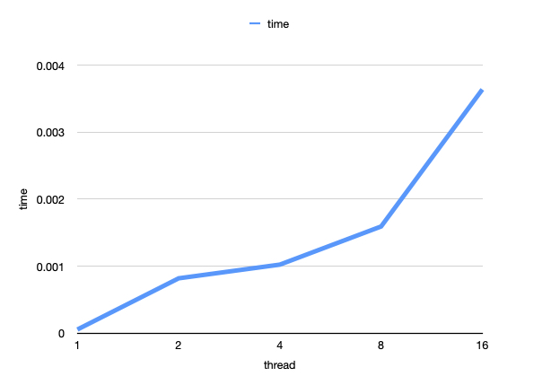

20000 edges:

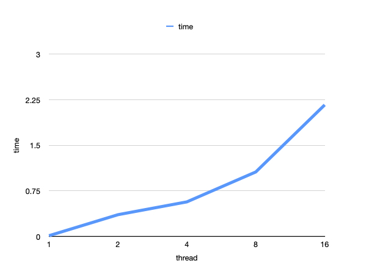

30000 edges:

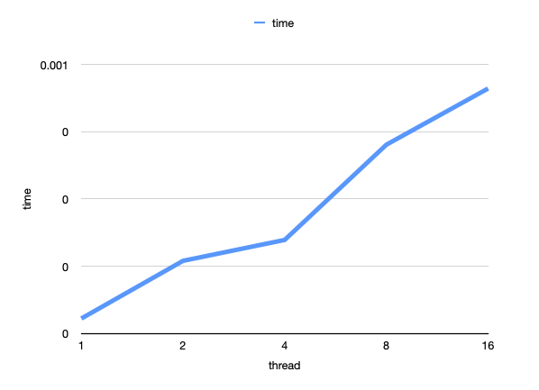

50000:

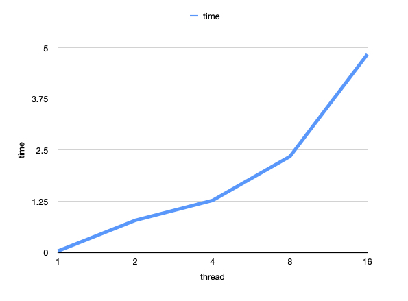

100000 edges:

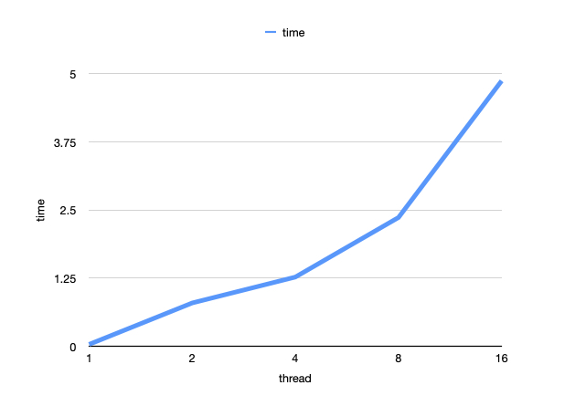

1000000 edges:

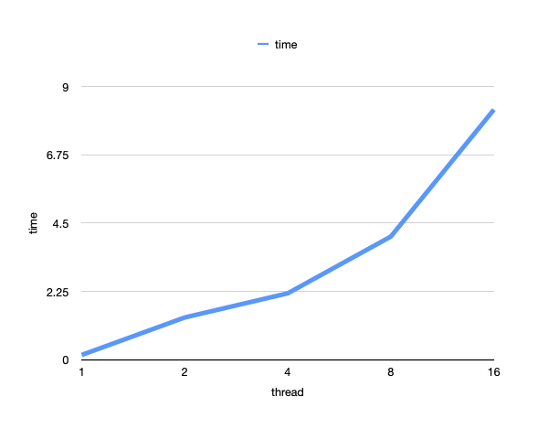

5000000 edges:

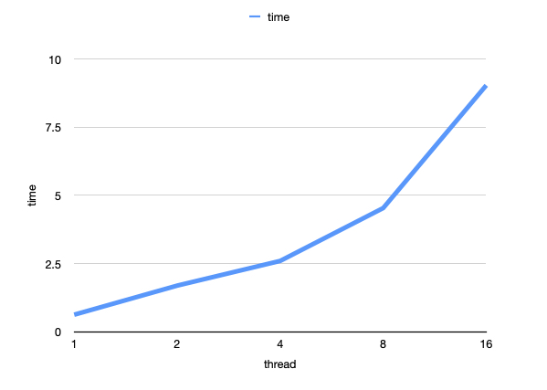

10000000 edges:

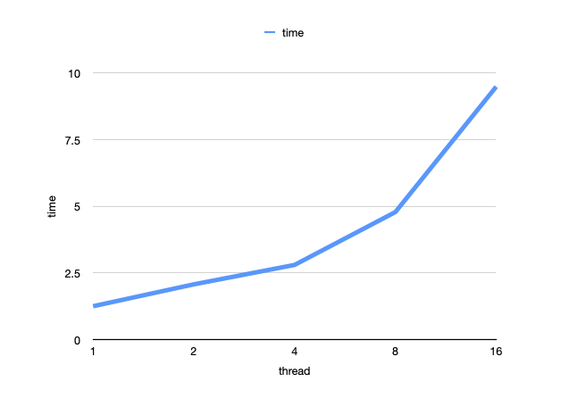

50000000 edges:

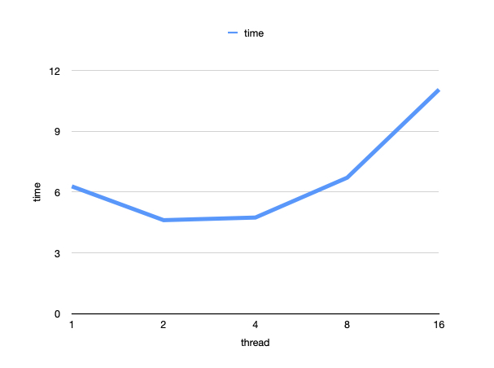
