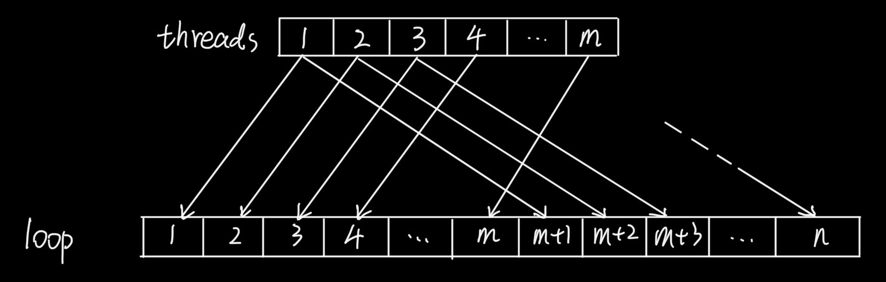

# 2022 Research Log

## 2022/3/1

Parallelized *for-loop* with Pthreads:

//

## 2022/2/28

A own *for-loop* function:

```c++
#include <iostream>

using namespace std;

template <typename F>
void para_for(int start, F const &f) {
    for (int i = start; f(i); ++i)
        cout << i << endl;
}

int main(int argc, const char * argv[]) {
    int max = 9;
    auto cond = [&](int i) -> bool {
        return i < max;
    };
    para_for(0, cond);
    return 0;
}
```

## 2022/2/27

Pthreads:

Basic usage:

```c++
#include <iostream>
#include <thread>

using namespace std;

void thread_func(int n, int &num) {
    cout << n << endl;
    num = 9;
}

int main(int argc, const char * argv[]) {
    int num = 0;
    thread t0(thread_func, 0, ref(num));
    t0.join();
    cout << num << endl;
    return 0;
}
```

Using *for-loop* creating threads:

```c++
#include <iostream>
#include <thread>
#include <vector>

using namespace std;

void thread_func(int n, int &num) {
    cout << n;
    num = n;
}

int main(int argc, const char * argv[]) {
    int num = 0;
    vector<thread> threads;
    for (int i = 0; i < 8; ++i)
        threads.emplace_back(thread(thread_func, i, ref(num)));
    for (thread &t : threads)
        t.join();
    cout << endl;
    cout << num << endl;
    return 0;
}
```

Lambda:

Using lambda expressions as parameters:

```c++
#include <iostream>

using namespace std;

template <typename F>
void test_lambda(F const &f) {
    if (f())
        cout << "True" << endl;
    else
        cout << "False" << endl;
}

int main(int argc, const char * argv[]) {
    int num = 9;
    auto lambda = [&]() -> bool {return num < 9;};
    test_lambda(lambda);
    return 0;
}
```

## 2022/2/25

OCaml:

//

Homework:

```ocaml
let rec union a b =
	match (a, b) with
	| ([], b) -> b
	| (a, []) -> a
	| (ha::ta, hb::tb) ->
		if ha < hb then ha::(union ta b)
		else if ha > hb then hb::(union a tb)
		else ha::(union ta tb);;
```

```ocaml
let rec reverse ls = rev ls []
and rev ls r = match ls with
	| [] -> r
	| h::t -> rev t (h::r);;
```

## 2022/2/23

Parallelization of delta-stepping algorithm:

If there are `m` threads and the loop will be done `n` times:

1. Thread No. 1 will deal with loop 1, 1 + m, 1 + 2m...
2. Thread No. 2 will deal with loop 2, 2 + m, 2 + 2m...
3. Thread No. `x` will deal with loop x, x + m, x + 2m...



## 2022/2/20

Pthreads:

Looking for a generic method to parallelized *for-loop* simply.

## 2022/2/18

OCaml:

//

OCaml Homework:

1. Slide P.15:

```
# sqrt 2.0 *. 2.0;;
- : float = 2.82842712474619029
```

```
# let distance x y = sqrt (x ** 2.0 +. y ** 2.0);;
val distance : float -> float -> float = <fun>
```

2. Slide P.32:

```
# let rec range m n =
  if m > n then []
  else m::range (m + 1) n;;
```

3. Slide P.33:

```
# let rec union a b =
    match a with
    | [] -> b
    | h::t -> if member h b
    then union t b
    else union t (h::b);;
```

## 2022/2/16

Delta-stepping algorithm:

```c++
#include <iostream>
#include <vector>
#include <fstream>
#include <algorithm>
#include <map>
#include <tuple>
#include <string>
#include <queue>
#include <stack>
#include <thread>
#include <mutex>
#include <chrono>

#define INF 0x3f3f3f3f
#define N 14081999

class Graph {
    int V, E;
    std::map<int, std::vector<std::tuple<int, int, int>>> G;
public:
    bool input_graph(std::string path) {
        std::ifstream file;
        file.open(path, std::ios::in);
        if (!file.is_open())
            return false;
        file >> V;
        file >> E;
        for (int i = 0; i < E; ++i) {
            int u, v, w;
            file >> u >> v >> w;
            G[u].push_back(std::make_tuple(u, v, w));
        }
        return true;
    }
    void show_graph() {
        for (int v = 0; v < V; ++v) {
            std::cout << v << " : ";
            for (auto i = G[v].begin(); i != G[v].end(); ++i)
                std::cout << std::get<0>(*i) << "-(" << std::get<2>(*i) << ")->" << std::get<1>(*i) << "  ";
            std::cout << std::endl;
        }
    }
    int vertices() {
        return V;
    }
    std::vector<std::tuple<int, int, int>> &edges(int v) {
        return G[v];
    }
};

using namespace std;

struct edge {
    int to, cost;
};
struct req {
    int v, w;
};

int delta, tnum;
int n, m, maxbucket, cnt;
int tent[N];
vector<int> B[N];
vector<int> S;
vector<req> REQ;

bool bempty()
{
    for (int i = 0; i <= maxbucket; ++i)
        if(!B[i].empty())
            return false;
    return true;
}

void relax(int w, int d)
{
    if (d < tent[w]) {
        if (tent[w] != INF) {
            vector<int>::iterator res = find(B[tent[w] / delta].begin(), B[tent[w] / delta].end(), w);
            if (res != B[tent[w] / delta].end())
                B[tent[w] / delta].erase(res);
        }
        B[d / delta].push_back(w);
        if (d / delta > maxbucket)
            maxbucket = d / delta;
        tent[w] = d;
    }
}
 
void delta_stepping(int s, Graph G)
{
    maxbucket = 0;
    for (int i = 0; i < n; ++i)
        tent[i] = INF;
    relax(s, 0);
    int j = 0;
    while (!bempty()) {
        S.clear();
        while (!B[j].empty()) {
            REQ.clear();
            // for-loop can be parallelized
            for (int i = 0; i < B[j].size(); ++i) {
                int vv = B[j][i];
                for (int k = 0; k < G.edges(vv).size(); ++k) {
                    if (get<2>(G.edges(vv)[k]) <= delta) {
                        req r;
                        r.v = get<1>(G.edges(vv)[k]);
                        r.w = tent[vv] + get<2>(G.edges(vv)[k]);
                        REQ.push_back(r);
                    }
                }
                S.push_back(vv);
            }
            B[j].clear();
            // for-loop can be parallelized
            for (int i = 0; i < REQ.size(); ++i)
                relax(REQ[i].v, REQ[i].w);
        }
        REQ.clear();
        // for-loop can be parallelized
        for (int i = 0; i < S.size(); ++i) {
            int vv = S[i];
            for (int k = 0; k < G.edges(vv).size(); ++k)
                if (get<2>(G.edges(vv)[k]) > delta) {
                    req r;
                    r.v = get<1>(G.edges(vv)[k]);
                    r.w = tent[vv] + get<2>(G.edges(vv)[k]);
                    REQ.push_back(r);
                }
        }
        // for-loop can be parallelized
        for (int i = 0; i < REQ.size(); ++i)
            relax(REQ[i].v, REQ[i].w);
        j++;
    }
}

int main(int argc, char** argv)
{
    Graph G;
    G.input_graph("./graph.txt");
    delta_stepping(0, G);
    return 0;
}
```

TODO:

* Check the correctness
* Parallelized

## 2022/2/15

面谈:

1. complete the delta- stepping algorithm.
2. Pthreads is recommended, continue learning Pthreads.
3. After mastering how to use Pthreads, I can learn new programming languages.
4. Learning RasPi.
5. Learning GPU programming(on RasPi)
6. Functional programming: OCaml (or Haskell)
7. Material of parallel programming:
   * https://www.cs.cmu.edu/~blelloch/research.html
   * https://www3.cs.stonybrook.edu/~rezaul/CSE613-S17.html
   * https://www.cs.cmu.edu/~guyb/paralg/paralg/parallel.pdf
8. Learning Rust language.
9. Writing research dialog everyday, and supplement previous research logs

## 2022/2/15(前の日誌の整理)

OpenMP:

```c++
#include <omp.h>
#include <stdio.h>
#include <stdlib.h>

int main()
{
    int nthreads, tid;

    #pragma omp parallel private(nthreads, tid)
    {
        tid = omp_get_thread_num();
        printf("Hello World from thread = %d\n", tid);

        if (tid == 0)
        {
            nthreads = omp_get_num_threads();
            printf("Number of threads = %d\n", nthreads);
        }

    }
    return 0;
}
```

Two types of *for-loop*:

```c++
#include <iostream>
 
using namespace std;

int main()
{
#pragma omp parallel  
    for (int i=0; i<10; i++) 
    {
        cout << i;
    } 
 
    return 0;
}
```

```c++
#include <iostream>
 
using namespace std;

int main()
{
#pragma omp parallel for
    for (int i=0; i<10; i++) 
    {
        cout << i;
    } 
 
    return 0;
}
```

Deal with data in loops:

```c++
#include <iostream>
#include <math.h>
 
using namespace std;
int main()
{
    const int NUMBER = 100;
    int* dataA = new int[NUMBER];
    int* dataB = new int[NUMBER];
    for (int i= 0; i < NUMBER; i++) {
        dataA[i] = i + 1;
        dataB[i] = 2 * (i + 1);
    }    
    long double sum = 0.0;
 
    omp_set_num_threads(4);
    #pragma omp parallel for reduction(+:sum)
    for (int i = 0; i < NUMBER;  i++) {
        sum += dataA[i] + dataB[i];
    }   
    cout << sum << endl;
 
    delete [] dataA;
    delete [] dataB;
    return 0;
}
```

Other important functions:

```c++
// set the number of threads
_OMPIMP void _OMPAPI omp_set_num_threads(int _Num_threads);
 // get the number of threads now
_OMPIMP int  _OMPAPI omp_get_num_threads(void);
 // get max number of threads
_OMPIMP int  _OMPAPI omp_get_max_threads(void);
 // get thread id
_OMPIMP int  _OMPAPI omp_get_thread_num(void);
 // get cpu core number
_OMPIMP int  _OMPAPI omp_get_num_procs(void);
_OMPIMP void _OMPAPI omp_set_dynamic(int _Dynamic_threads);
_OMPIMP int  _OMPAPI omp_get_dynamic(void);
_OMPIMP int  _OMPAPI omp_in_parallel(void);
_OMPIMP void _OMPAPI omp_set_nested(int _Nested);
_OMPIMP int  _OMPAPI omp_get_nested(void);
_OMPIMP void _OMPAPI omp_init_lock(omp_lock_t * _Lock);
_OMPIMP void _OMPAPI omp_destroy_lock(omp_lock_t * _Lock); _OMPIMP void _OMPAPI omp_set_lock(omp_lock_t * _Lock);
_OMPIMP void _OMPAPI omp_unset_lock(omp_lock_t * _Lock);
_OMPIMP int  _OMPAPI omp_test_lock(omp_lock_t * _Lock);
_OMPIMP void _OMPAPI omp_init_nest_lock(omp_nest_lock_t * _Lock);
_OMPIMP void _OMPAPI omp_destroy_nest_lock(omp_nest_lock_t * _Lock);
_OMPIMP void _OMPAPI omp_set_nest_lock(omp_nest_lock_t * _Lock);
 _OMPIMP void _OMPAPI omp_unset_nest_lock(omp_nest_lock_t * _Lock);
_OMPIMP int  _OMPAPI omp_test_nest_lock(omp_nest_lock_t * _Lock);
_OMPIMP double _OMPAPI omp_get_wtime(void);
_OMPIMP double _OMPAPI omp_get_wtick(void);
```

Dijkstra's algorithm:

```c++
#include <iostream>
#include <fstream>
#include <map>
#include <vector>
#include <tuple>
#include <string>
#include <queue>
#include <stack>
#include <thread>
#include <mutex>
#include <chrono>

class Graph {
    int V, E;
    std::map<int, std::vector<std::tuple<int, int, int>>> G;
public:
    bool input_graph(std::string path) {
        std::ifstream file;
        file.open(path, std::ios::in);
        if (!file.is_open())
            return false;
        file >> V;
        file >> E;
        for (int i = 0; i < E; ++i) {
            int u, v, w;
            file >> u >> v >> w;
            G[u].push_back(std::make_tuple(u, v, w));
        }
        return true;
    }
    void show_graph() {
        for (int v = 0; v < V; ++v) {
            std::cout << v << " : ";
            for (auto i = G[v].begin(); i != G[v].end(); ++i)
                std::cout << std::get<0>(*i) << "-(" << std::get<2>(*i) << ")->" << std::get<1>(*i) << "  ";
            std::cout << std::endl;
        }
    }
    int vertices() {
        return V;
    }
    std::vector<std::tuple<int, int, int>> &edges(int v) {
        return G[v];
    }
};

// Dijkstra
class Dijkstra {
protected:
    Graph G;
    int s;
    int *distTo = nullptr;
    int *edgeTo = nullptr;
    std::chrono::time_point<std::chrono::steady_clock> _start, _end;
    std::chrono::duration<double> diff;
    static bool relax(Dijkstra &D, std::tuple<int, int, int> e, int &r) {
        int u = std::get<0>(e);
        int v = std::get<1>(e);
        int w = std::get<2>(e);
        if (D.distTo[v] > D.distTo[u] + w) {
            D.distTo[v] = D.distTo[u] + w;
            D.edgeTo[v] = u;
            r = v;
            return true;
        }
        return false;
    }
    void start() {
        _start = std::chrono::steady_clock::now();
    }
    void end() {
        _end = std::chrono::steady_clock::now();
        diff = _end - _start;
    }
public:
    static const int INFINITY = 99999;
    Dijkstra(Graph &G, int s): G(G), s(s) {
        distTo = new int[G.vertices()];
        edgeTo = new int[G.vertices()];
        _start = std::chrono::steady_clock::now();
        _end = _start;
    }
    ~Dijkstra() {
        delete [] distTo;
        delete [] edgeTo;
    }
    void run() {
        start();
        for (int v = 0; v < G.vertices(); ++v)
            distTo[v] = INFINITY;
        distTo[s] = 0;
        auto dist_greater = [&](const int &i, const int &j) -> bool { return distTo[i] > distTo[j]; };
        std::priority_queue<int, std::vector<int>, decltype(dist_greater)> minHeap(dist_greater);
        minHeap.push(s);
        while (!minHeap.empty()) {
            int v = minHeap.top();
            minHeap.pop();
            auto edges = G.edges(v);
            #pragma omp parallel for
            for (int i = 0; i < edges.size(); ++i) {
                int r;
                if (relax(*this, edges[i], r))
                    minHeap.push(r);
            }
        }
        end();
    }
    void result() {
        std::cout << "Source: " << s << std::endl;
        for (int i = 0; i < G.vertices(); ++i) {
            std::cout << s << "-(" << distTo[i] << ")->" << i << " : ";
            std::stack<int> path;
            for (int j = i; j != s; j = edgeTo[j])
                path.push(j);
            path.push(s);
            while (!path.empty()) {
                std::cout << path.top() << " ";
                path.pop();
            }
            std::cout << std::endl;
        }
    }
    void time() {
        std::cout << "Time: " << diff.count() << std::endl;
    }
};

// Main
int main(int argc, char *argv[])
{
    if (argc == 1) {
        Graph G;
        // G.input_graph(std::string(argv[1]));
        G.input_graph("./graph.txt");
        // G.show_graph();
        Dijkstra D(G, 0);
        D.run();
        D.result();
        D.time();
    }
    return 0;
}
```

## 2022/1/12

Delta-stepping algorithm:

```c++
#include <iostream>
#include <vector>
#include <fstream>
#include <algorithm>

#define INF 0x3f3f3f3f
#define N 14081999

using namespace std;

struct edge {
    int to, cost;
};
struct req {
    int v, w;
};

int delta, tnum;
int n, m, maxbucket, cnt;
fstream f, ss;
vector<edge> G[N];
int tent[N];
vector<int> B[N];
vector<int> S;
vector<req> REQ;
int source[999];

bool bempty()
{
    for (int i = 0; i <= maxbucket; ++i)
        if(!B[i].empty())
            return false;
    return true;
}

void relax(int w, int d)
{
    if (d < tent[w]) {
        if (tent[w] != INF) {
            vector<int>::iterator res = find(B[tent[w] / delta].begin(), B[tent[w] / delta].end(), w);
            if (res != B[tent[w] / delta].end())
                B[tent[w] / delta].erase(res);
        }
        B[d / delta].push_back(w);
        if (d / delta > maxbucket)
            maxbucket = d / delta;
        tent[w] = d;
    }
}
 
void delta_stepping(int s)
{
    maxbucket = 0;
    for (int i = 0; i < n; ++i)
        tent[i] = INF;
    relax(s, 0);
    int j = 0;
    while (!bempty()) {
        S.clear();
        while (!B[j].empty()) {
            REQ.clear();
            // for-loop can be parallelized
            for (int i = 0; i < B[j].size(); ++i) {
                int vv = B[j][i];
                for (int k = 0; k < G[vv].size(); ++k)
                    if (G[vv][k].cost <= delta) {
                        req r;
                        r.v = G[vv][k].to;
                        r.w = tent[vv] + G[vv][k].cost;
                        REQ.push_back(r);
                    }
                S.push_back(vv);
            }
            B[j].clear();
            // for-loop can be parallelized
            for (int i = 0; i < REQ.size(); ++i)
                relax(REQ[i].v, REQ[i].w);
        }
        REQ.clear();
        // for-loop can be parallelized
        for (int i = 0; i < S.size(); ++i) {
            int vv = S[i];
            for (int k = 0; k < G[vv].size(); ++k)
                if (G[vv][k].cost > delta) {
                    req r;
                    r.v = G[vv][k].to;
                    r.w = tent[vv] + G[vv][k].cost;
                    REQ.push_back(r);
                }
        }
        // for-loop can be parallelized
        for (int i = 0; i < REQ.size(); ++i)
            relax(REQ[i].v, REQ[i].w);
        j++;
    }
}
```

TODO:

* Graph Class
* Parallelized

## 2022/1/2

面白い問題一つです。

中国のDMアプリでオイラー路を解けたRed Packetがもらえるゲームがあります。彼女からとっても複雑のオイラー路問題がもらった、一応Undirected Graphのオイラー路を解けるプログラムを書きました。

```c++
#include <iostream>
#include <fstream>

int vertices, edges;
int matrix[999][999];
int degree[999];
int c_count = 0;
int circuit[999];

void DFS(int s)
{
    for (int i = 0; i < vertices; ++i) {
        if (matrix[s][i]) {
            matrix[s][i] = matrix[i][s] = 0;
            DFS(i);
        }
    }
    circuit[c_count++] = s;
}

int main(int argc, char const *argv[])
{
    for (int i = 0; i < 999; ++i)
        for (int j = 0; j < 999; ++j)
            matrix[i][j] = 0;
    std::ifstream file;
    file.open("./redpacket_graph.txt", std::ios::in);
    if (!file.is_open())
        return -1;
    file >> vertices;
    file >> edges;
    for (int i = 0; i < edges; ++i) {
        int u, v;
        file >> u >> v;
        matrix[u][v] = matrix[v][u] = 1;
        degree[u]++;
        degree[v]++;
    }
    int count = 0;
    int start = 0;
    for (int i = 0; i < vertices; ++i) {
        if (degree[i] % 2 == 1) {
            count++;
            start = i;
        }
    }
    if (count != 0 && count != 2) {
        return -1;
    }
    else {
        DFS(start);
        for (int i = 0; i < c_count; ++i) {
            std::cout << circuit[i] << " ";
        }
        std::cout << std::endl;
    }
    return 0;
}
```

DFSでオイラー路が解けます。プログラムが読める図はEdge Graph Formatで表示します。

今の研究と関係がないが、おもしろい問題ですそしてこれも図の問題です、だから研究日誌に記録します。