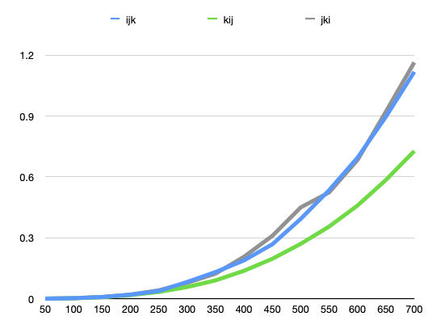
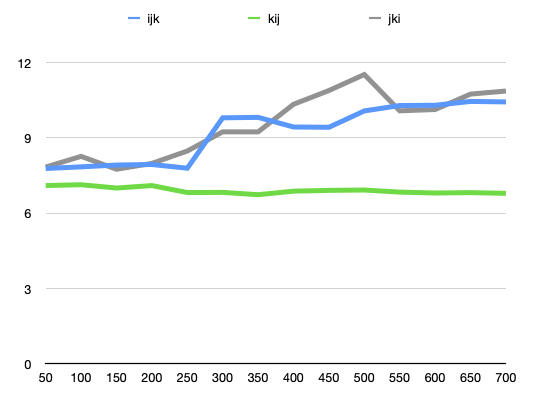
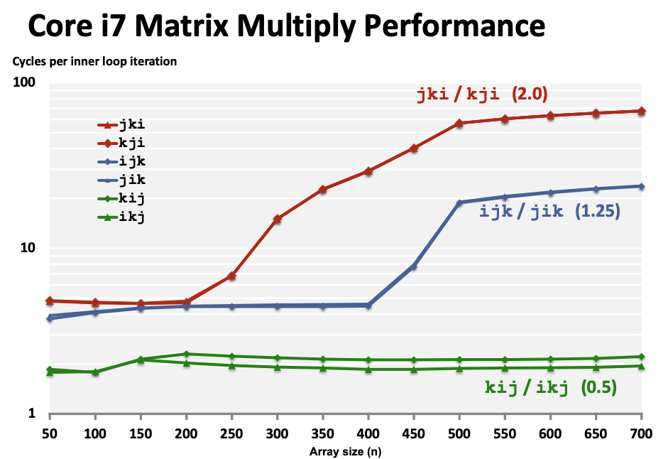
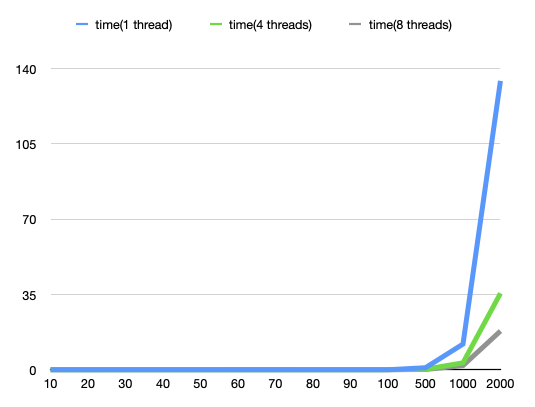
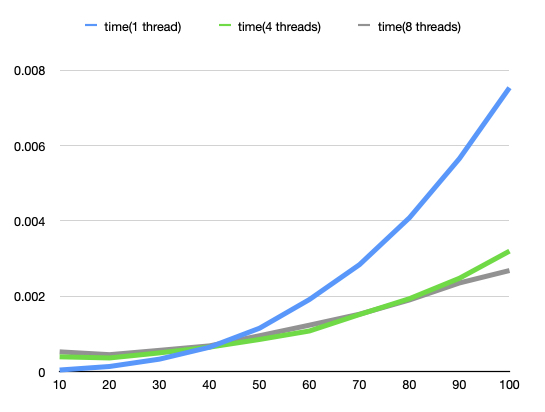

# 2022 Research Log

## 2022/3/31

Benchmark:

//

## 2022/3/29

Parallelized *kij*:

```c++
#include <iostream>
#include <fstream>
#include <thread>
#include <vector>

class Matrix {
    friend class Matrix_kij;
public:
    typedef int** matrix_t;
    typedef int* vector_t;
protected:
    matrix_t matrix = nullptr;
    int column = 0;
    int row = 0;
public:
    ~Matrix() {
        for (int i = 0; i < row; ++i) {
            delete [] matrix[i];
            matrix[i] = nullptr;
        }
        delete [] matrix;
        matrix = nullptr;
    }
    Matrix() = default;
    Matrix(int row, int column, matrix_t matrix) {
        this->row = row;
        this->column = column;
        this->matrix = new vector_t[row];
        for (int i = 0; i < row; ++i) {
            this->matrix[i] = new int[column];
            for (int j = 0; j < column; ++j)
                this->matrix[i][j] = matrix[i][j];
        }
    }
    Matrix(Matrix &m) {
        row = m.row;
        column = m.column;
        matrix = new vector_t[row];
        for (int i = 0; i < row; ++i) {
            matrix[i] = new int[column];
            for (int j = 0; j < column; ++j)
                matrix[i][j] = m.matrix[i][j];
        }
    }
    Matrix &operator=(const Matrix &m) {
        row = m.row;
        column = m.column;
        matrix = new vector_t[row];
        for (int i = 0; i < row; ++i) {
            matrix[i] = new int[column];
            for (int j = 0; j < column; ++j)
                matrix[i][j] = m.matrix[i][j];
        }
        return *this;
    }
    friend std::ifstream &operator>>(std::ifstream &input, Matrix &m) {
        input >> m.row;
        input >> m.column;
        m.matrix = new vector_t[m.row];
        for (int i = 0; i < m.row; ++i) {
            m.matrix[i] = new int[m.column];
            for (int j = 0; j < m.column; ++j)
                input >> m.matrix[i][j];
        }
        return input;
    }
    friend std::ostream &operator<<(std::ostream &output, const Matrix &m) {
        for (int i = 0; i < m.row; ++i) {
            for (int j = 0; j < m.column; ++j)
                std::cout << m.matrix[i][j] << "\t";
            std::cout << std::endl;
        }
        return output;
    }
};

class Matrix_kij: protected Matrix {
private:
    unsigned long _thread_num = 1;
    static void _thread(void *m1, void *m2, Matrix::matrix_t tmp, unsigned int count, int start_row, int start_column) {
        auto *mA = (Matrix_kij*)m1;
        auto *mB = (Matrix_kij*)m2;
        int k = start_column;
        for (int i = start_row; i < mA->row; ++i) {
            for (; k < mA->column; ++k) {
                int r = mA->matrix[i][k];
                for (int j = 0; j < mB->column; ++j)
                    tmp[i][j] += r * mB->matrix[k][j];
                if (!(--count))
                    return;
            }
            k = 0;
        }
    }
public:
    explicit Matrix_kij(Matrix &m) {
        row = m.row;
        column = m.column;
        matrix = new vector_t[row];
        for (int i = 0; i < row; ++i) {
            matrix[i] = new int[column];
            for (int j = 0; j < column; ++j)
                matrix[i][j] = m.matrix[i][j];
        }
    }
    void set_thread_num(unsigned long threads) {
        if (threads < std::thread::hardware_concurrency())
            _thread_num = threads;
    }
    Matrix operator*(const Matrix_kij &m) const {
        Matrix::matrix_t tmp;
        tmp = new Matrix::vector_t[row];
        for (int i = 0; i < row; ++i) {
            tmp[i] = new int[m.column];
            memset(tmp[i], 0, m.column * sizeof(int));
        }
        if (_thread_num == 1)
            for (int k = 0; k < column; ++k)
                for (int i = 0; i < row; ++i) {
                    int r = matrix[i][k];
                    for (int j = 0; j < m.column; ++j)
                        tmp[i][j] += r * m.matrix[k][j];
                }
        else if (_thread_num > 1) {
            unsigned int block_size = (row * column) / _thread_num;
            std::vector<std::thread> threads;
            for (unsigned long t = 0; t < _thread_num; ++t)
                threads.emplace_back(std::thread(_thread, (void*)this, (void*)&m, tmp, (t == _thread_num - 1 ? (row * column - block_size * t) : block_size), (block_size * t / row), (block_size * t % row)));
            for (std::thread &t : threads)
                t.join();
        }
        return {row, m.column, tmp};
    }
};

class Timer {
private:
    std::chrono::time_point<std::chrono::steady_clock> _start, _end;
    std::chrono::duration<double> diff{};
public:
    Timer() {
        _start = std::chrono::steady_clock::now();
        _end = _start;
        diff = _end - _start;
    }
    void start() {
        _start = std::chrono::steady_clock::now();
    }
    void end() {
        _end = std::chrono::steady_clock::now();
        diff = _end - _start;
    }
    double time() {
        return diff.count();
    }
};

int main() {
    std::ifstream mA;
    mA.open("./mA.txt", std::ios::in);
    std::ifstream mB;
    mB.open("./mB.txt", std::ios::in);
    Matrix A, B;
    mA >> A;
    mB >> B;
    mA.close();
    mB.close();
    Timer timer;
    // kij
    Matrix_kij A_kij(A);
    Matrix_kij B_kij(B);
    timer.start();
    Matrix Result_kij = A_kij * B_kij;
    timer.end();
    std::cout << timer.time() << std::endl;
    // kij - 2
    A_kij.set_thread_num(2);
    B_kij.set_thread_num(2);
    timer.start();
    Matrix Result_kij_2 = A_kij * B_kij;
    timer.end();
    std::cout << timer.time() << std::endl;
    // kij - 4
    A_kij.set_thread_num(4);
    B_kij.set_thread_num(4);
    timer.start();
    Matrix Result_kij_4 = A_kij * B_kij;
    timer.end();
    std::cout << timer.time() << std::endl;
    // kij - 8
    A_kij.set_thread_num(8);
    B_kij.set_thread_num(8);
    timer.start();
    Matrix Result_kij_8 = A_kij * B_kij;
    timer.end();
    std::cout << timer.time() << std::endl;
    // kij - 16
    A_kij.set_thread_num(16);
    B_kij.set_thread_num(16);
    timer.start();
    Matrix Result_kij_16 = A_kij * B_kij;
    timer.end();
    std::cout << timer.time() << std::endl;
    // kij - 32
    A_kij.set_thread_num(32);
    B_kij.set_thread_num(32);
    timer.start();
    Matrix Result_kij_32 = A_kij * B_kij;
    timer.end();
    std::cout << timer.time() << std::endl;
    return 0;
}
```

* *X* elements per thread:

$$
X = \begin{cases}
(Row \times Column) \div NumberOfThreads& \text{not last thread}\\
Row \times Column - [(Row \times Column) \div NumberOfThreads] \times (NumberOfThreads - 1)& \text{last thread}
\end{cases}
$$

## 2022/3/27

Benchmark:

Specs:

```
Model Name:	Mac Pro
Model Identifier:	MacPro7,1
Enclosure:	Tower
Processor Name:	16-Core Intel Xeon W
Processor Speed:	3.2 GHz
Number of Processors:	1
Total Number of Cores:	16
L2 Cache (per Core):	1 MB
L3 Cache:	22 MB
Hyper-Threading Technology:	Enabled
Memory:	96 GB
System Firmware Version:	1731.100.130.0.0 (iBridge: 19.16.14242.0.0,0)
OS Loader Version:	540.100.7~14
```

Times:

| **size** | **ijk**     | **kij**    | **jki**     |
| -------- | ----------- | ---------- | ----------- |
| **50**   | 0.000303847 | 0.00027725 | 0.000306025 |
| **100**  | 0.00245108  | 0.00222869 | 0.00258165  |
| **150**  | 0.00834827  | 0.00738206 | 0.00817197  |
| **200**  | 0.019842    | 0.0177448  | 0.019953    |
| **250**  | 0.0380355   | 0.0332996  | 0.0413782   |
| **300**  | 0.0826602   | 0.057593   | 0.0779464   |
| **350**  | 0.131497    | 0.0902291  | 0.123746    |
| **400**  | 0.188632    | 0.137508   | 0.206703    |
| **450**  | 0.268237    | 0.196668   | 0.309942    |
| **500**  | 0.393399    | 0.270333   | 0.450042    |
| **550**  | 0.534819    | 0.355445   | 0.52384     |
| **600**  | 0.694997    | 0.459113   | 0.683589    |
| **650**  | 0.8968      | 0.585037   | 0.921857    |
| **700**  | 1.11802     | 0.727566   | 1.16442     |

Cycles per inner loop iteration:
$$
([Times]\div(1\div(3.2\times10^9)))\div[Size]^3
$$

| **size** | **ijk**          | **kij**          | **jki**          |
| -------- | ---------------- | ---------------- | ---------------- |
| **50**   | 7.7784832        | 7.0976           | 7.83424          |
| **100**  | 7.843456         | 7.131808         | 8.26128          |
| **150**  | 7.91539674074074 | 6.99928651851852 | 7.74823822222222 |
| **200**  | 7.9368           | 7.09792          | 7.9812           |
| **250**  | 7.7896704        | 6.81975808       | 8.47425536       |
| **300**  | 9.79676444444444 | 6.82583703703704 | 9.23809185185185 |
| **350**  | 9.81435335276968 | 6.73430017492711 | 9.23585306122449 |
| **400**  | 9.4316           | 6.8754           | 10.33515         |
| **450**  | 9.41957091906722 | 6.90631111111111 | 10.8841086419753 |
| **500**  | 10.0710144       | 6.9205248        | 11.5210752       |
| **550**  | 10.2865262208866 | 6.83650788880541 | 10.0753598797896 |
| **600**  | 10.2962518518519 | 6.80167407407407 | 10.1272444444444 |
| **650**  | 10.4497405553027 | 6.81699918070096 | 10.7417110605371 |
| **700**  | 10.4305072886297 | 6.78778775510204 | 10.8633935860058 |

**Graph**:

Times:



Cycles per inner loop iteration:



\[Reference data]:



**Conclusion**:

* The experimental data (results) and the reference data have roughly the same trend.
* The trend of *jki* is not totally same as  reference data, I think it might have something to do with the generated matrix data or the computer specifications.

TODO:

Increase the amount of experimental data.

## 2022/3/26

Program of *ijk*, *kij* and *jki*:

```c++
#include <iostream>
#include <fstream>

class Matrix {
    friend class Matrix_ijk;
    friend class Matrix_kij;
    friend class Matrix_jki;
public:
    typedef int** matrix_t;
    typedef int* vector_t;
protected:
    matrix_t matrix = nullptr;
    int column = 0;
    int row = 0;
public:
    ~Matrix() {
        for (int i = 0; i < row; ++i) {
            delete [] matrix[i];
            matrix[i] = nullptr;
        }
        delete [] matrix;
        matrix = nullptr;
    }
    Matrix() = default;
    Matrix(int row, int column, matrix_t matrix) {
        this->row = row;
        this->column = column;
        this->matrix = new vector_t[row];
        for (int i = 0; i < row; ++i) {
            this->matrix[i] = new int[column];
            for (int j = 0; j < column; ++j)
                this->matrix[i][j] = matrix[i][j];
        }
    }
    Matrix(Matrix &m) {
        row = m.row;
        column = m.column;
        matrix = new vector_t[row];
        for (int i = 0; i < row; ++i) {
            matrix[i] = new int[column];
            for (int j = 0; j < column; ++j)
                matrix[i][j] = m.matrix[i][j];
        }
    }
    Matrix &operator=(const Matrix &m) {
        row = m.row;
        column = m.column;
        matrix = new vector_t[row];
        for (int i = 0; i < row; ++i) {
            matrix[i] = new int[column];
            for (int j = 0; j < column; ++j)
                matrix[i][j] = m.matrix[i][j];
        }
        return *this;
    }
    friend std::ifstream &operator>>(std::ifstream &input, Matrix &m) {
        input >> m.row;
        input >> m.column;
        m.matrix = new vector_t[m.row];
        for (int i = 0; i < m.row; ++i) {
            m.matrix[i] = new int[m.column];
            for (int j = 0; j < m.column; ++j)
                input >> m.matrix[i][j];
        }
        return input;
    }
    friend std::ostream &operator<<(std::ostream &output, const Matrix &m) {
        for (int i = 0; i < m.row; ++i) {
            for (int j = 0; j < m.column; ++j)
                std::cout << m.matrix[i][j] << "\t";
            std::cout << std::endl;
        }
        return output;
    }
};

class Matrix_ijk: protected Matrix {
public:
    explicit Matrix_ijk(Matrix &m) {
        row = m.row;
        column = m.column;
        matrix = new vector_t[row];
        for (int i = 0; i < row; ++i) {
            matrix[i] = new int[column];
            for (int j = 0; j < column; ++j)
                matrix[i][j] = m.matrix[i][j];
        }
    }
    Matrix operator*(const Matrix_ijk &m) const {
        Matrix::matrix_t tmp;
        tmp = new Matrix::vector_t[row];
        for (int i = 0; i < row; ++i) {
            tmp[i] = new int[m.column];
            for (int j = 0; j < m.column; ++j) {
                int sum = 0;
                for (int k = 0; k < row; ++k)
                    sum += matrix[i][k] * m.matrix[k][j];
                tmp[i][j] = sum;
            }
        }
        return {row, m.column, tmp};
    }
};

class Matrix_kij: protected Matrix {
public:
    explicit Matrix_kij(Matrix &m) {
        row = m.row;
        column = m.column;
        matrix = new vector_t[row];
        for (int i = 0; i < row; ++i) {
            matrix[i] = new int[column];
            for (int j = 0; j < column; ++j)
                matrix[i][j] = m.matrix[i][j];
        }
    }
    Matrix operator*(const Matrix_kij &m) const {
        Matrix::matrix_t tmp;
        tmp = new Matrix::vector_t[row];
        for (int i = 0; i < row; ++i) {
            tmp[i] = new int[m.column];
            memset(tmp[i], 0, m.column * sizeof(int));
        }
        for (int k = 0; k < column; ++k)
            for (int i = 0; i < row; ++i) {
                int r = matrix[i][k];
                for (int j = 0; j < m.column; ++j)
                    tmp[i][j] += r * m.matrix[k][j];
            }
        return {row, m.column, tmp};
    }
};

class Matrix_jki: protected Matrix {
public:
    explicit Matrix_jki(Matrix &m) {
        row = m.row;
        column = m.column;
        matrix = new vector_t[row];
        for (int i = 0; i < row; ++i) {
            matrix[i] = new int[column];
            for (int j = 0; j < column; ++j)
                matrix[i][j] = m.matrix[i][j];
        }
    }
    Matrix operator*(const Matrix_jki &m) const {
        Matrix::matrix_t tmp;
        tmp = new Matrix::vector_t[row];
        for (int i = 0; i < row; ++i) {
            tmp[i] = new int[m.column];
            memset(tmp[i], 0, m.column * sizeof(int));
        }
        for (int j = 0; j < m.column; ++j)
            for (int k = 0; k < column; ++k) {
                int r = m.matrix[k][j];
                for (int i = 0; i < row; ++i)
                    tmp[i][j] += matrix[i][k] * r;
            }
        return {row, m.column, tmp};
    }
};

class Timer {
private:
    std::chrono::time_point<std::chrono::steady_clock> _start, _end;
    std::chrono::duration<double> diff{};
public:
    Timer() {
        _start = std::chrono::steady_clock::now();
        _end = _start;
        diff = _end - _start;
    }
    void start() {
        _start = std::chrono::steady_clock::now();
    }
    void end() {
        _end = std::chrono::steady_clock::now();
        diff = _end - _start;
    }
    double time() {
        return diff.count();
    }
};

int main() {
    std::ifstream mA;
    mA.open("./mA.txt", std::ios::in);
    std::ifstream mB;
    mB.open("./mB.txt", std::ios::in);
    Matrix A, B;
    mA >> A;
    mB >> B;
    mA.close();
    mB.close();
    Timer timer;
    // ijk
    Matrix_ijk A_ijk(A);
    Matrix_ijk B_ijk(B);
    timer.start();
    Matrix Result_ijk = A_ijk * B_ijk;
    timer.end();
    std::cout << timer.time() << std::endl;
    // kij
    Matrix_kij A_kij(A);
    Matrix_kij B_kij(B);
    timer.start();
    Matrix Result_kij = A_kij * B_kij;
    timer.end();
    std::cout << timer.time() << std::endl;
    // jki
    Matrix_jki A_jki(A);
    Matrix_jki B_jki(B);
    timer.start();
    Matrix Result_jki = A_jki * B_jki;
    timer.end();
    std::cout << timer.time() << std::endl;
    return 0;
}
```

Use C-Array instead of std::vector.

## 2022/3/24

Matrix Multiplication：

* **ijk**:

  * Multiply mA(N x M) and mB(M x K)
  * total operations:

  $$
  O(N^2 \times K)
  $$

  * K reads per source element in mA and N reads per source element in mB
  * Miss rate: (set block size to 32B, and type of elements is *double*)
    * mA: 25%
    * mB: 100%
    * mResult: 0

* **kij**:

  * Miss rate:
    * mA: 0
    * mB: 25%
    * mResult: 25%

* **jki**:

  * Miss rate:
    * mA: 100%
    * mB: 0
    * mResult: 100%

## 2022/3/23

Review:

Layout of C Arrays in Memory:

* C arrays allocated in row-major order
  * each row in contiguous memory locations
  * a\[i][j] = a[i * N + j] where N is the number of columns
* Stepping through columns in one row
  * accesses successive elements
  * if block size (B) > sizeof(aij) bytes, exploit spatial locality
    * miss rate = sizeof(aij) / B
* Stepping through rows in one column
  * accesses distant elements
  * no spatial locality
    * miss rate = 1

## 2022/3/21

https://www.cs.cmu.edu/~213/lectures/10-cache-memories.pdf

https://www.cs.cmu.edu/~213/schedule.html

//

## 2022/3/18

Benchmark results:

//

## 2022/3/14

Doing benchmark on ***parmigiano***.

* `/proc/cpuinfo`: (final processor)

```
processor       : 31
vendor_id       : AuthenticAMD
cpu family      : 23
model           : 8
model name      : AMD Ryzen Threadripper 2990WX 32-Core Processor
stepping        : 2
microcode       : 0x800820b
cpu MHz         : 1717.568
cache size      : 512 KB
physical id     : 0
siblings        : 32
core id         : 11
cpu cores       : 32
apicid          : 59
initial apicid  : 59
fpu             : yes
fpu_exception   : yes
cpuid level     : 13
wp              : yes
flags           : fpu vme de pse tsc msr pae mce cx8 apic sep mtrr pge mca cmov pat pse36 clflush mmx fxsr sse sse2 ht syscall nx mmxext fxsr_opt pdpe1gb rdtscp lm constant_tsc rep_good nopl nonstop_tsc cpuid extd_apicid amd_dcm aperfmperf pni pclmulqdq monitor ssse3 fma cx16 sse4_1 sse4_2 movbe popcnt aes xsave avx f16c rdrand lahf_lm cmp_legacy svm extapic cr8_legacy abm sse4a misalignsse 3dnowprefetch osvw skinit wdt tce topoext perfctr_core perfctr_nb bpext perfctr_llc mwaitx cpb hw_pstate sme ssbd ibpb vmmcall fsgsbase bmi1 avx2 smep bmi2 rdseed adx smap clflushopt sha_ni xsaveopt xsavec xgetbv1 xsaves clzero irperf xsaveerptr arat npt lbrv svm_lock nrip_save tsc_scale vmcb_clean flushbyasid decodeassists pausefilter pfthreshold avic v_vmsave_vmload vgif overflow_recov succor smca
bugs            : sysret_ss_attrs null_seg spectre_v1 spectre_v2 spec_store_bypass
bogomips        : 5988.32
TLB size        : 2560 4K pages
clflush size    : 64
cache_alignment : 64
address sizes   : 43 bits physical, 48 bits virtual
power management: ts ttp tm hwpstate cpb eff_freq_ro [13] [14]
```

* `/proc/meminfo`:

```
MemTotal:       65693892 kB
MemFree:        54163396 kB
MemAvailable:   56192440 kB
Buffers:          137708 kB
Cached:          2270424 kB
SwapCached:         9280 kB
Active:          8279964 kB
Inactive:        1899792 kB
Active(anon):    7759152 kB
Inactive(anon):    11292 kB
Active(file):     520812 kB
Inactive(file):  1888500 kB
Unevictable:           0 kB
Mlocked:               0 kB
SwapTotal:       8388604 kB
SwapFree:        8316644 kB
Dirty:                 0 kB
Writeback:             0 kB
AnonPages:       7770284 kB
Mapped:            52528 kB
Shmem:                84 kB
Slab:             739976 kB
SReclaimable:     265956 kB
SUnreclaim:       474020 kB
KernelStack:        9312 kB
PageTables:        22956 kB
NFS_Unstable:          0 kB
Bounce:                0 kB
WritebackTmp:          0 kB
CommitLimit:    41235548 kB
Committed_AS:    8483852 kB
VmallocTotal:   34359738367 kB
VmallocUsed:           0 kB
VmallocChunk:          0 kB
HardwareCorrupted:     0 kB
AnonHugePages:         0 kB
ShmemHugePages:        0 kB
ShmemPmdMapped:        0 kB
CmaTotal:              0 kB
CmaFree:               0 kB
HugePages_Total:       0
HugePages_Free:        0
HugePages_Rsvd:        0
HugePages_Surp:        0
Hugepagesize:       2048 kB
DirectMap4k:      905664 kB
DirectMap2M:    26234880 kB
DirectMap1G:    39845888 kB
```

## 2022/3/13

Refactored the main function of the matrix multiplication algorithm:

```c++
int main([[maybe_unused]] int argc, [[maybe_unused]] char *argv[]) {
    if (argc == 4) {
        std::ifstream mA;
        mA.open(argv[1], std::ios::in);
        std::ifstream mB;
        mB.open(argv[2], std::ios::in);
        Timer timer;
        std::stringstream ss;
        ss << argv[3];
        unsigned long thread_num;
        ss >> thread_num;
        Matrix A;
        Matrix B;
        mA >> A;
        mB >> B;
#ifdef DEBUG
        std::cout << "Matrix A:" << std::endl;
        std::cout << A;
        std::cout << "Matrix B:" << std::endl;
        std::cout << B;
#endif
        if (thread_num == 1) {
            timer.start();
            Matrix R = A * B;
            timer.end();
#ifdef DEBUG
            std::cout << thread_num << " thread Result:" << std::endl;
            std::cout << R;
#endif
            std::cout << thread_num << " thread Time: " << timer.time() << std::endl;
        }
        else if (thread_num > 1) {
            PMatrix pA = (PMatrix)A;
            PMatrix pB = (PMatrix)B;
            pA.set_threads(thread_num);
            pB.set_threads(thread_num);
            timer.start();
            PMatrix pR = pA * pB;
            timer.end();
#ifdef DEBUG
            std::cout << thread_num << " threads Result:" << std::endl;
            std::cout << pR;
#endif
            std::cout << thread_num <<" threads Time: " << timer.time() << std::endl;
        }
        mA.close();
        mB.close();
    }
    else if (argc == 2) {
        if (std::string(argv[1]) == "-h")
            std::cout << "Hardware threads: " << PMatrix::hardware_threads() << std::endl;
    }
    return 0;
}
```

Using shell scripts to generate matrixs and make benchmark:

```shell
#!/bin/bash
echo "Start..."
mkdir benchmark
cp ./matrix_generator ./benchmark/
cd ./benchmark || exit
touch generator.log
for (( i = 100; i < 1000; i = i + 100 )); do
    echo "Generate $i"
    mkdir "$i"
    cd "./$i" || exit
    ../matrix_generator "mA.txt" "$i" "$i" >> ../generator.log || echo "Error in generate $i mA" >> ../generator.log
    ../matrix_generator "mB.txt" "$i" "$i" >> ../generator.log || echo "Error in generate $i mB" >> ../generator.log
    cd ..
done
for (( i = 1000; i < 10000; i = i + 1000 )); do
    echo "Generate $i"
    mkdir "$i"
    cd "./$i" || exit
    ../matrix_generator "mA.txt" "$i" "$i" >> ../generator.log || echo "Error in generate $i mA" >> ../generator.log
    ../matrix_generator "mB.txt" "$i" "$i" >> ../generator.log || echo "Error in generate $i mB" >> ../generator.log
    cd ..
done
for (( i = 10000; i <= 70000; i = i + 10000 )); do
    echo "Generate $i"
    mkdir "$i"
    cd "./$i" || exit
    ../matrix_generator "mA.txt" "$i" "$i" >> ../generator.log || echo "Error in generate $i mA" >> ../generator.log
    ../matrix_generator "mB.txt" "$i" "$i" >> ../generator.log || echo "Error in generate $i mB" >> ../generator.log
    cd ..
done
echo "Generated ALL DONE." >> ./generator.log
echo "Generated ALL DONE."
```

```shell
#!/bin/bash
echo "Start..."
cp ./matrix_multiplication ./benchmark/
cd benchmark || exit
touch results.log
./matrix_multiplication "-h" >> ./results.log || echo "Error in get hardware threads" >> ./results.log
for (( i = 100; i < 1000; i = i + 100 )); do
    echo "Benchmark $i"
    echo "Benchmark $i:" >> ./results.log
    cd "./$i" || exit
    for (( j = 1; j <= 256; j = j * 2 )); do
        ../matrix_multiplication "mA.txt" "mB.txt" "$j" >> ../results.log || echo "Error in benchmark $i threads $j" >> ../results.log
    done
    cd ..
done
for (( i = 1000; i < 10000; i = i + 1000 )); do
    echo "Benchmark $i"
    echo "Benchmark $i:" >> ./results.log
    cd "./$i" || exit
    for (( j = 1; j <= 256; j = j * 2 )); do
        ../matrix_multiplication "mA.txt" "mB.txt" "$j" >> ../results.log || echo "Error in benchmark $i threads $j" >> ../results.log
    done
    cd ..
done
for (( i = 10000; i <= 70000; i = i + 10000 )); do
    echo "Benchmark $i"
    echo "Benchmark $i:" >> ./results.log
    cd "./$i" || exit
    for (( j = 1; j <= 256; j = j * 2 )); do
        ../matrix_multiplication "mA.txt" "mB.txt" "$j" >> ../results.log || echo "Error in benchmark $i threads $j" >> ../results.log
    done
    cd ..
done
echo "Benchmark ALL DONE." >> ./results.log
echo "Benchmark ALL DONE."
```

## 2022/3/12

Matrix generation program has low performance, so I made some improvements:

* Using reference to prevent unnecessary copy of varables;
* Using arguments to generate different matrix

```c++
#include <iostream>
#include <vector>
#include <random>
#include <fstream>
#include <sstream>

class Matrix {
public:
    typedef std::vector<std::vector<int>> matrix_type;
    typedef unsigned long rank_type;
    typedef std::vector<int> vector_type;
private:
    [[maybe_unused]] rank_type row, column;
    matrix_type matrix;
public:
    explicit Matrix(matrix_type &m) {
        row = m.size();
        column = !row ? 0 : m[0].size();
        matrix = m;
    }
    friend std::ostream &operator<<(std::ostream &output, const Matrix &m) {
        for (const vector_type &v : m.matrix) {
            for (int element : v)
                output << element << " ";
            output << std::endl;
        }
        return output;
    }
};

class MatrixGenerator {
private:
    int row, column;
    Matrix *matrix = nullptr;
public:
    MatrixGenerator(int _row, int _column): row(_row), column(_column) {
        std::random_device r;
        std::default_random_engine e1(r());
        std::uniform_int_distribution<int> uniform_dist(0, 9);
        Matrix::matrix_type mv;
        for (int i = 0; i < row; ++i) {
            Matrix::vector_type v;
            for (int j = 0; j < column; ++j)
                v.push_back(uniform_dist(e1));
            mv.push_back(v);
        }
        matrix = new Matrix(mv);
    }
    ~MatrixGenerator() {
        delete matrix;
    }
    void save(const std::string &path) {
        if (matrix) {
            std::ofstream file;
            file.open(path, std::ios::out);
            file << row << " " << column << std::endl;
            file << *matrix << std::endl;
            file.close();
        }
    }
};

int main([[maybe_unused]] int argc, [[maybe_unused]] char * argv[]) {
    if (argc == 4) {
        int row, column;
        std::stringstream ss;
        ss << argv[2];
        ss >> row;
        ss.clear();
        ss.str("");
        ss << argv[3];
        ss >> column;
        MatrixGenerator mg(row, column);
        mg.save(std::string(argv[1]));
        std::cout << "Generate: matrix(" << row << " x " << column << ")" << std::endl;
    }
    else {
        std::cout << "Usage: " << argv[0] << " <file path> <row of matrix> <column of matrix>" << std::endl;
    }
    return 0;
}
```

The new program can generate 70000 * 70000 matrix on `parmigiano` (64Gbyte memory).

Matrix generation algorithms can also be accelerated by multithreading.

## 2022/3/10

Fix a bug of matrix multiplication program, and change the method for selecting the number of threads:

```c++
#include <iostream>
#include <utility>
#include <vector>
#include <thread>
#include <cmath>
#include <fstream>

//#define DEBUG
//#define RUN_SINGLE_THREAD

class Matrix {
private:
    typedef std::vector<std::vector<int>> matrix_type;
    typedef unsigned long rank_type;
    typedef std::vector<int> vector_type;
    friend class PMatrix;
    rank_type row, column;
    matrix_type matrix;
public:
    explicit Matrix(matrix_type m) {
        row = m.size();
        column = !row ? 0 : m[0].size();
        matrix = m;
    }
    Matrix(): Matrix(matrix_type()) {}
    friend std::ifstream &operator>>(std::ifstream &input, Matrix &m) {
        input >> m.row;
        input >> m.column;
        for (rank_type r = 0; r < m.row; ++r) {
            vector_type v;
            for (rank_type c = 0; c < m.column; ++c) {
                int t;
                input >> t;
                v.push_back(t);
            }
            m.matrix.push_back(v);
        }
        return input;
    }
    friend std::ostream &operator<<(std::ostream &output, const Matrix &m) {
        for (const vector_type &v : m.matrix) {
            for (int element : v)
                output << element << "\t";
            output << std::endl;
        }
        return output;
    }
    Matrix operator*(const Matrix &m) const {
        matrix_type tmp;
        if (column == m.row) {
            for (rank_type i = 0; i < row; ++i) {
                vector_type v;
                for (rank_type j = 0; j < m.column; ++j) {
                    int element = 0;
                    for (rank_type k = 0; k < column; ++k) {
                        element += matrix[i][k] * m.matrix[k][j];
                    }
                    v.push_back(element);
                }
                tmp.push_back(v);
            }
        }
        Matrix result(tmp);
        return result;
    }
};

class PMatrix: public Matrix {
private:
    static const unsigned long _threads_num = 4;
    static void _thread(matrix_type &result, PMatrix mA, PMatrix mB, rank_type block, rank_type start_row) {
        for (rank_type i = start_row; i < start_row + block; ++i) {
            vector_type v;
            for (rank_type j = 0; j < mB.column; ++j) {
                int element = 0;
                for (rank_type k = 0; k < mA.column; ++k) {
                    element += mA.matrix[i][k] * mB.matrix[k][j];
                }
                v.push_back(element);
            }
            result.push_back(v);
        }
    }
public:
    [[maybe_unused]] explicit PMatrix(const Matrix &m) {
        row = m.row;
        column = m.column;
        matrix = m.matrix;
    }
    explicit PMatrix(matrix_type m): Matrix(std::move(m)) {}
    PMatrix operator*(const PMatrix &m) const {
        matrix_type tmp;
        if (column == m.row) {
            unsigned long threads_num = row > _threads_num ? _threads_num : row;
            rank_type block = row / threads_num;
            std::vector<matrix_type> results(threads_num);
            std::vector<std::thread> threads;
            for (unsigned long t = 0; t < threads_num; ++t)
                threads.emplace_back(std::thread(_thread, std::ref(results[t]), *this, m, (t < threads_num - 1 ? block : row - t * block), t * block));
            for (std::thread &t : threads)
                t.join();
            for (matrix_type &r : results)
                tmp.insert(tmp.end(), r.begin(), r.end());
        }
        PMatrix result(tmp);
        return result;
    }
};

class Timer {
private:
    std::chrono::time_point<std::chrono::steady_clock> _start, _end;
    std::chrono::duration<double> diff{};
public:
    Timer() {
        _start = std::chrono::steady_clock::now();
        _end = _start;
        diff = _end - _start;
    }
    void start() {
        _start = std::chrono::steady_clock::now();
    }
    void end() {
        _end = std::chrono::steady_clock::now();
        diff = _end - _start;
    }
    double time() {
        return diff.count();
    }
};

int main([[maybe_unused]] int argc, [[maybe_unused]] char *argv[]) {
    std::ifstream mA;
    mA.open("./mA.txt", std::ios::in);
    std::ifstream mB;
    mB.open("./mB.txt", std::ios::in);
    Timer timer;
    Matrix A;
    Matrix B;
    mA >> A;
    mB >> B;
#ifdef DEBUG
    std::cout << "Matrix A:" << std::endl;
    std::cout << A;
    std::cout << "Matrix B:" << std::endl;
    std::cout << B;
#endif
#ifdef RUN_SINGLE_THREAD
    timer.start();
    Matrix R = A * B;
    timer.end();
#ifdef DEBUG
    std::cout << "Result:" << std::endl;
    std::cout << R;
#endif
    std::cout << "Time: " << timer.time() << std::endl;
#endif
    PMatrix pA = (PMatrix)A;
    PMatrix pB = (PMatrix)B;
    timer.start();
    PMatrix pR = pA * pB;
    timer.end();
#ifdef DEBUG
    std::cout << "P Result:" << std::endl;
    std::cout << pR;
#endif
    std::cout << "P Time: " << timer.time() << std::endl;
    return 0;
}
```

***Benchmark:*** (parmigiano)


## 2022/3/10

Get the number of concurrent threads system supported:

```c++
#include <thread>

unsigned int n = std::thread::hardware_concurrency();
```

## 2022/3/9

I find the matrix multiplication program performance is very poor(when two 1000 * 1000 matrixs are multiplied, it will spend a lot of time), so I improve the algorithm of multi-threads matrix multiplication:

```c++
#include <iostream>
#include <utility>
#include <vector>
#include <thread>
#include <cmath>
#include <fstream>

#define DEBUG

class Matrix {
private:
    typedef std::vector<std::vector<int>> matrix_type;
    typedef unsigned long rank_type;
    typedef std::vector<int> vector_type;
    friend class PMatrix;
    rank_type row, column;
    matrix_type matrix;
public:
    explicit Matrix(matrix_type m) {
        row = m.size();
        column = !row ? 0 : m[0].size();
        matrix = m;
    }
    Matrix(): Matrix(matrix_type()) {}
    friend std::ifstream &operator>>(std::ifstream &input, Matrix &m) {
        input >> m.row;
        input >> m.column;
        for (rank_type r = 0; r < m.row; ++r) {
            vector_type v;
            for (rank_type c = 0; c < m.column; ++c) {
                int t;
                input >> t;
                v.push_back(t);
            }
            m.matrix.push_back(v);
        }
        return input;
    }
    friend std::ostream &operator<<(std::ostream &output, const Matrix &m) {
        for (const vector_type &v : m.matrix) {
            for (int element : v)
                output << element << "\t";
            output << std::endl;
        }
        return output;
    }
    Matrix operator*(const Matrix &m) const {
        matrix_type tmp;
        if (column == m.row) {
            for (rank_type i = 0; i < row; ++i) {
                vector_type v;
                for (rank_type j = 0; j < m.column; ++j) {
                    int element = 0;
                    for (rank_type k = 0; k < column; ++k) {
                        element += matrix[i][k] * m.matrix[k][j];
                    }
                    v.push_back(element);
                }
                tmp.push_back(v);
            }
        }
        Matrix result(tmp);
        return result;
    }
};

class PMatrix: public Matrix {
private:
    static const unsigned long threads_num = 4;
    static void _thread(matrix_type &result, PMatrix mA, PMatrix mB, rank_type block, rank_type start_row) {
        for (rank_type i = start_row; i < start_row + block; ++i) {
            vector_type v;
            for (rank_type j = 0; j < mB.column; ++j) {
                int element = 0;
                for (rank_type k = 0; k < mA.column; ++k) {
                    element += mA.matrix[i][k] * mB.matrix[k][j];
                }
                v.push_back(element);
            }
            result.push_back(v);
        }
    }
public:
    [[maybe_unused]] explicit PMatrix(const Matrix &m) {
        row = m.row;
        column = m.column;
        matrix = m.matrix;
    }
    explicit PMatrix(matrix_type m): Matrix(std::move(m)) {}
    PMatrix operator*(const PMatrix &m) const {
        matrix_type tmp;
        if (column == m.row) {
            rank_type block = std::ceil((double)row / (double)threads_num);
            std::vector<matrix_type> results(threads_num);
            std::vector<std::thread> threads;
            for (unsigned long t = 0; t < threads_num; ++t)
                threads.emplace_back(std::thread(_thread, std::ref(results[t]), *this, m, (row - t * block >= block ? block : row - t * block), t * block));
            for (std::thread &t : threads)
                t.join();
            for (matrix_type &r : results)
                tmp.insert(tmp.end(), r.begin(), r.end());
        }
        PMatrix result(tmp);
        return result;
    }
};

class Timer {
private:
    std::chrono::time_point<std::chrono::steady_clock> _start, _end;
    std::chrono::duration<double> diff{};
public:
    Timer() {
        _start = std::chrono::steady_clock::now();
        _end = _start;
        diff = _end - _start;
    }
    void start() {
        _start = std::chrono::steady_clock::now();
    }
    void end() {
        _end = std::chrono::steady_clock::now();
        diff = _end - _start;
    }
    double time() {
        return diff.count();
    }
};

int main([[maybe_unused]] int argc, [[maybe_unused]] char *argv[]) {
    std::ifstream mA;
    mA.open("./mA.txt", std::ios::in);
    std::ifstream mB;
    mB.open("./mB.txt", std::ios::in);
    Timer timer;
    Matrix A;
    Matrix B;
    mA >> A;
    mB >> B;
#ifdef DEBUG
    std::cout << "Matrix A:" << std::endl;
    std::cout << A;
    std::cout << "Matrix B:" << std::endl;
    std::cout << B;
#endif
    timer.start();
    Matrix R = A * B;
    timer.end();
#ifdef DEBUG
    std::cout << "Result:" << std::endl;
    std::cout << R;
#endif
    std::cout << "Time: " << timer.time() << std::endl;
    PMatrix pA = (PMatrix)A;
    PMatrix pB = (PMatrix)B;
    timer.start();
    PMatrix pR = pA * pB;
    timer.end();
#ifdef DEBUG
    std::cout << "P Result:" << std::endl;
    std::cout << pR;
#endif
    std::cout << "P Time: " << timer.time() << std::endl;
    return 0;
}
```

Improve point:

Parallelized method in version 1 will use *n* threads to compute one element in result. It will execute *create-join* operation *matrixA.row \* matrixB.column \* n* times.

But in version 2, matrixA is divided into *n* small matrix, and one thread compute the multiplication of every small matrix and matrixB.

***Benchmark***:

| **row/column** | **time(1 thread)** | **time(4 threads)** | **time(8 threads)** |
| -------------- | ------------------ | ------------------- | ------------------- |
| **10**         | 0.000039554        | 0.000390017         | 0.000522796         |
| **20**         | 0.000133721        | 0.000360164         | 0.000447025         |
| **30**         | 0.000329015        | 0.000494832         | 0.000562465         |
| **40**         | 0.000645744        | 0.000647674         | 0.000681134         |
| **50**         | 0.00114985         | 0.000851287         | 0.000950188         |
| **60**         | 0.00191395         | 0.00107704          | 0.00123167          |
| **70**         | 0.00283829         | 0.00151404          | 0.0015221           |
| **80**         | 0.0040848          | 0.00193485          | 0.00190089          |
| **90**         | 0.00565676         | 0.00247712          | 0.00235211          |
| **100**        | 0.00753642         | 0.0031971           | 0.00268168          |
| **500**        | 0.960772           | 0.269345            | 0.145958            |
| **1000**       | 11.9551            | 3.22906             | 1.93215             |
| **2000**       | 134.269            | 35.539              | 18.0095             |





## 2022/3/8

Repair the matrix multiplication program:

```c++
#include <iostream>
#include <utility>
#include <vector>
#include <thread>
#include <cmath>
#include <fstream>

class Matrix {
private:
    typedef std::vector<std::vector<int>> matrix_type;
    typedef unsigned long rank_type;
    typedef std::vector<int> vector_type;
    friend class PMatrix;
    rank_type row, column;
    matrix_type matrix;
public:
    explicit Matrix(matrix_type m) {
        row = m.size();
        column = !row ? 0 : m[0].size();
        matrix = m;
    }
    Matrix(): Matrix(matrix_type()) {}
    friend std::ifstream &operator>>(std::ifstream &input, Matrix &m) {
        input >> m.row;
        input >> m.column;
        for (rank_type r = 0; r < m.row; ++r) {
            vector_type v;
            for (rank_type c = 0; c < m.column; ++c) {
                int t;
                input >> t;
                v.push_back(t);
            }
            m.matrix.push_back(v);
        }
        return input;
    }
    friend std::ostream &operator<<(std::ostream &output, const Matrix &m) {
        for (const vector_type &v : m.matrix) {
            for (int element : v)
                output << element << "\t";
            output << std::endl;
        }
        return output;
    }
    Matrix operator*(const Matrix &m) const {
        matrix_type tmp;
        if (column == m.row) {
            for (rank_type i = 0; i < row; ++i) {
                vector_type v;
                for (rank_type j = 0; j < m.column; ++j) {
                    int element = 0;
                    for (rank_type k = 0; k < column; ++k) {
                        element += matrix[i][k] * m.matrix[k][j];
                    }
                    v.push_back(element);
                }
                tmp.push_back(v);
            }
        }
        Matrix result(tmp);
        return result;
    }
};

std::mutex mut;

class PMatrix: public Matrix {
private:
    static const unsigned long threads_num = 4;
    static void _thread(int &element, PMatrix mA, PMatrix mB, rank_type i, rank_type j, rank_type k, rank_type gap) {
        while (gap--) {
            mut.lock();
            element += mA.matrix[i][k] * mB.matrix[k][j];
            mut.unlock();
            k++;
        }
    }
public:
    [[maybe_unused]] explicit PMatrix(const Matrix &m) {
        row = m.row;
        column = m.column;
        matrix = m.matrix;
    }
    explicit PMatrix(matrix_type m): Matrix(std::move(m)) {}
    PMatrix operator*(const PMatrix &m) const {
        matrix_type tmp;
        if (column == m.row) {
            for (rank_type i = 0; i < row; ++i) {
                vector_type v;
                for (rank_type j = 0; j < m.column; ++j) {
                    int element = 0;
                    rank_type gap = std::ceil((double)column / (double)threads_num);
                    std::vector<std::thread> threads;
                    for (unsigned long t = 0; t < threads_num; ++t) {
                        threads.emplace_back(std::thread(_thread, std::ref(element), *this, m, i, j, t * gap, (column - t * gap >= gap) ? gap : (column - t * gap)));
                    }
                    for (std::thread &t : threads) {
                        t.join();
                    }
                    v.push_back(element);
                }
                tmp.push_back(v);
            }
        }
        PMatrix result(tmp);
        return result;
    }
};

class Timer {
private:
    std::chrono::time_point<std::chrono::steady_clock> _start, _end;
    std::chrono::duration<double> diff{};
public:
    Timer() {
        _start = std::chrono::steady_clock::now();
        _end = _start;
        diff = _end - _start;
    }
    void start() {
        _start = std::chrono::steady_clock::now();
    }
    void end() {
        _end = std::chrono::steady_clock::now();
        diff = _end - _start;
    }
    double time() {
        return diff.count();
    }
};

int main([[maybe_unused]] int argc, [[maybe_unused]] char *argv[]) {
    std::ifstream mA;
    mA.open("/Users/gabriel/Desktop/matrix_multiplication/mA.txt", std::ios::in);
    std::ifstream mB;
    mB.open("/Users/gabriel/Desktop/matrix_multiplication/mB.txt", std::ios::in);
    Timer timer;
    Matrix A;
    Matrix B;
    mA >> A;
    mB >> B;
    std::cout << "Matrix A:" << std::endl;
    std::cout << A;
    std::cout << "Matrix B:" << std::endl;
    std::cout << B;
    timer.start();
    Matrix R = A * B;
    timer.end();
    std::cout << "Result:" << std::endl;
    std::cout << R;
    std::cout << "Time: " << timer.time() << std::endl;
    PMatrix pA = (PMatrix)A;
    PMatrix pB = (PMatrix)B;
    timer.start();
    PMatrix pR = pA * pB;
    timer.end();
    std::cout << "P Result:" << std::endl;
    std::cout << pR;
    std::cout << "Time: " << timer.time() << std::endl;
    return 0;
}
```

And write a program to generate matrix for benchmarking:

```c++
#include <iostream>
#include <vector>
#include <random>
#include <fstream>
#include <sstream>

class Matrix {
public:
    typedef std::vector<std::vector<int>> matrix_type;
    typedef unsigned long rank_type;
    typedef std::vector<int> vector_type;
private:
    [[maybe_unused]] rank_type row, column;
    matrix_type matrix;
public:
    explicit Matrix(matrix_type m) {
        row = m.size();
        column = !row ? 0 : m[0].size();
        matrix = m;
    }
    friend std::ostream &operator<<(std::ostream &output, const Matrix &m) {
        for (const vector_type &v : m.matrix) {
            for (int element : v)
                output << element << " ";
            output << std::endl;
        }
        return output;
    }
};

class MatrixGenerator {
private:
    int mArow, mAcolumn_mBrow, mBcolumn;
    Matrix *mA = nullptr, *mB = nullptr;
public:
    MatrixGenerator(int _mArow, int _mAcolumn_mBrow, int _mBcolumn): mArow(_mArow), mAcolumn_mBrow(_mAcolumn_mBrow), mBcolumn(_mBcolumn) {
        std::random_device r;
        std::default_random_engine e1(r());
        std::uniform_int_distribution<int> uniform_dist(0, 99);
        Matrix::matrix_type mAv, mBv;
        for (int i = 0; i < mArow; ++i) {
            Matrix::vector_type v;
            for (int j = 0; j < mAcolumn_mBrow; ++j)
                v.push_back(uniform_dist(e1));
            mAv.push_back(v);
        }
        for (int i = 0; i < mAcolumn_mBrow; ++i) {
            Matrix::vector_type v;
            for (int j = 0; j < mBcolumn; ++j)
                v.push_back(uniform_dist(e1));
            mBv.push_back(v);
        }
        mA = new Matrix(mAv);
        mB = new Matrix(mBv);
    }
    ~MatrixGenerator() {
        delete mA;
        delete mB;
    }
    void save() {
        if (mA && mB) {
            std::ofstream fileA, fileB;
            std::stringstream ss;
            fileA.open("./mA.txt", std::ios::out);
            ss << mArow << " " << mAcolumn_mBrow << std::endl;
            ss << *mA << std::endl;
            fileA << ss.str();
            fileA.close();
            ss.clear();
            ss.str("");
            fileB.open("./mB.txt", std::ios::out);
            ss << mAcolumn_mBrow << " " << mBcolumn << std::endl;
            ss << *mB << std::endl;
            fileB << ss.str();
            fileB.close();
        }
    }
};

int main([[maybe_unused]] int argc, [[maybe_unused]] char * argv[]) {
    int mArow, mAcolumn_mBrow, mBcolumn;
    std::cout << "Input Matrix A - row: ";
    std::cin >> mArow;
    std::cout << "Input Matrix A - column: ";
    std::cin >> mAcolumn_mBrow;
    std::cout << "Matrix B - row: " << mAcolumn_mBrow << std::endl;
    std::cout << "Input Matrix B - column: ";
    std::cin >> mBcolumn;
    MatrixGenerator mg(mArow, mAcolumn_mBrow, mBcolumn);
    mg.save();
    return 0;
}
```

TODO:

Benchmarking.

## 2022/3/7

Test program can run rightly by deleting reference from thread function:

```c++
static void _thread(int &result, PVector v1, PVector v2, int start, unsigned long gap) {
    while (gap--) {
        mut.lock();
        result += v1.vec[start] * v2.vec[start];
        mut.unlock();
        start++;
    }
}
```

Generate a thread by this:

```c++
threads.emplace_back(std::thread(_thread, std::ref(result), *this, v, i * gap, size - i * gap >= gap ? gap : size - i * gap));
```

So that it will not use any reference of object of class PVector.

***Reference Page*** of `std::thread` and `std::ref`:

* https://en.cppreference.com/w/cpp/thread/thread/thread
* https://en.cppreference.com/w/cpp/utility/functional/ref

## 2022/3/4

A simple program can cause same error:

```c++
#include <iostream>
#include <vector>
#include <thread>
#include <cmath>

std::mutex mut;

class PVector {
private:
    static const unsigned long threads_num = 2;
    unsigned long size;
    std::vector<int> vec;
    static void _thread(int &result, PVector &v1, PVector &v2, int start, unsigned long gap) {
        while (gap--) {
            mut.lock();
            result += v1.vec[start] * v2.vec[start];
            mut.unlock();
            start++;
        }
    }
public:
    explicit PVector(const std::vector<int> &v): vec(v), size(v.size()) {}
    int operator*(const PVector &v) const {
        int result = 0;
        unsigned long gap = std::ceil((double)size / (double)threads_num);
        std::vector<std::thread> threads;
        threads.reserve(threads_num);
        for (int i = 0; i < threads_num; ++i)
            threads.emplace_back(std::thread(_thread, std::ref(result),std::ref(*this), std::ref(v), i * gap, size - i * gap >= gap ? gap : size - i * gap));
        for (std::thread &t : threads)
            t.join();
        return result;
    }
};

int main() {
    PVector v1(std::vector{1, 2, 3, 4, 5, 6, 7, 8, 9});
    PVector v2(std::vector{9, 8, 7, 6, 5, 4, 3, 2, 1});
    int n = v1 * v2;
    std::cout << n << std::endl;
    return 0;
}
```

Just using clang to compile this program:

```
In file included from ./main.cpp:3:
/Applications/Xcode.app/Contents/Developer/Platforms/MacOSX.platform/Developer/SDKs/MacOSX.sdk/usr/include/c++/v1/thread:286:5: error: attempt to use a deleted function
    _VSTD::__invoke(_VSTD::move(_VSTD::get<1>(__t)), _VSTD::move(_VSTD::get<_Indices>(__t))...);
    ^
/Applications/Xcode.app/Contents/Developer/Platforms/MacOSX.platform/Developer/SDKs/MacOSX.sdk/usr/include/c++/v1/__config:856:15: note: expanded from macro '_VSTD'
#define _VSTD std::_LIBCPP_ABI_NAMESPACE
              ^
/Applications/Xcode.app/Contents/Developer/Platforms/MacOSX.platform/Developer/SDKs/MacOSX.sdk/usr/include/c++/v1/thread:297:12: note: in instantiation of function template specialization 'std::__thread_execute<std::unique_ptr<std::__thread_struct>, void (*)(int &, PVector &, PVector &, int, unsigned long), std::reference_wrapper<int>, std::reference_wrapper<const PVector>, std::reference_wrapper<const PVector>, unsigned long, unsigned long, 2, 3, 4, 5, 6>' requested here
    _VSTD::__thread_execute(*__p.get(), _Index());
           ^
/Applications/Xcode.app/Contents/Developer/Platforms/MacOSX.platform/Developer/SDKs/MacOSX.sdk/usr/include/c++/v1/thread:313:54: note: in instantiation of function template specialization 'std::__thread_proxy<std::tuple<std::unique_ptr<std::__thread_struct>, void (*)(int &, PVector &, PVector &, int, unsigned long), std::reference_wrapper<int>, std::reference_wrapper<const PVector>, std::reference_wrapper<const PVector>, unsigned long, unsigned long>>' requested here
    int __ec = _VSTD::__libcpp_thread_create(&__t_, &__thread_proxy<_Gp>, __p.get());
                                                     ^
./main.cpp:29:34: note: in instantiation of function template specialization 'std::thread::thread<void (&)(int &, PVector &, PVector &, int, unsigned long), std::reference_wrapper<int>, std::reference_wrapper<const PVector>, std::reference_wrapper<const PVector>, unsigned long, unsigned long, void>' requested here
            threads.emplace_back(std::thread(_thread, std::ref(result),std::ref(*this), std::ref(v), i * gap, size - i * gap >= gap ? gap : size - i * gap));
                                 ^
/Applications/Xcode.app/Contents/Developer/Platforms/MacOSX.platform/Developer/SDKs/MacOSX.sdk/usr/include/c++/v1/type_traits:1916:5: note: '~__nat' has been explicitly marked deleted here
    ~__nat() = delete;
    ^
1 error generated.
```

TODO:

Solve this problem.

## 2022/3/3

Matrix multiplication: (with some problems)

```c++
#include <iostream>
#include <utility>
#include <vector>
#include <thread>
#include <cmath>
#include <fstream>

class Matrix {
private:
    typedef std::vector<std::vector<int>> matrix_type;
    typedef unsigned long rank_type;
    typedef std::vector<int> vector_type;
    friend class PMatrix;
    rank_type row, column;
    matrix_type matrix;
public:
    explicit Matrix(matrix_type m) {
        row = m.size();
        column = !row ? 0 : m[0].size();
        matrix = m;
    }
    Matrix(): Matrix(matrix_type()) {}
    friend std::ifstream &operator>>(std::ifstream &input, Matrix &m) {
        input >> m.row;
        input >> m.column;
        for (rank_type r = 0; r < m.row; ++r) {
            vector_type v;
            for (rank_type c = 0; c < m.column; ++c) {
                int t;
                input >> t;
                v.push_back(t);
            }
            m.matrix.push_back(v);
        }
        return input;
    }
    friend std::ostream &operator<<(std::ostream &output, const Matrix &m) {
        for (const vector_type &v : m.matrix) {
            for (int element : v)
                output << element << "\t";
            output << std::endl;
        }
        return output;
    }
    Matrix operator*(const Matrix &m) const {
        matrix_type tmp;
        if (column == m.row) {
            for (rank_type i = 0; i < row; ++i) {
                vector_type v;
                for (rank_type j = 0; j < m.column; ++j) {
                    int element = 0;
                    for (rank_type k = 0; k < column; ++k) {
                        element += matrix[i][k] * m.matrix[k][j];
                    }
                    v.push_back(element);
                }
                tmp.push_back(v);
            }
        }
        Matrix result(tmp);
        return result;
    }
};

std::mutex mut;

class PMatrix: public Matrix {
private:
    static const unsigned long threads_num = 4;
    static void _thread(int &element, PMatrix &mA, PMatrix &mB, rank_type i, rank_type j, rank_type k, rank_type gap) {
        while (gap--) {
            mut.lock();
            element += mA.matrix[i][k] * mB.matrix[k][j];
            mut.unlock();
            k++;
        }
    }
public:
    [[maybe_unused]] explicit PMatrix(const Matrix &m) {
        row = m.row;
        column = m.column;
        matrix = m.matrix;
    }
    explicit PMatrix(matrix_type m): Matrix(std::move(m)) {}
    PMatrix operator*(const PMatrix &m) const {
        matrix_type tmp;
        if (column == m.row) {
            for (rank_type i = 0; i < row; ++i) {
                vector_type v;
                for (rank_type j = 0; j < m.column; ++j) {
                    int element = 0;
                    rank_type gap = std::ceil((double)column / (double)threads_num);
                    std::vector<std::thread> threads;
                    for (unsigned long t = 0; t < threads_num; ++t) {
                        threads.emplace_back(std::thread(_thread, std::ref(element), std::ref(*this), std::ref(m), i, j, t * gap, (column - t * gap >= gap) ? gap : (column - t * gap)));
                    }
                    for (std::thread &t : threads) {
                        t.join();
                    }
                    v.push_back(element);
                }
                tmp.push_back(v);
            }
        }
        PMatrix result(tmp);
        return result;
    }
};

class Timer {
private:
    std::chrono::time_point<std::chrono::steady_clock> _start, _end;
    std::chrono::duration<double> diff{};
public:
    Timer() {
        _start = std::chrono::steady_clock::now();
        _end = _start;
        diff = _end - _start;
    }
    void start() {
        _start = std::chrono::steady_clock::now();
    }
    void end() {
        _end = std::chrono::steady_clock::now();
        diff = _end - _start;
    }
    double time() {
        return diff.count();
    }
};

int main([[maybe_unused]] int argc, [[maybe_unused]] char *argv[]) {
    std::ifstream mA;
    mA.open("/Users/gabriel/Desktop/matrix_multiplication/mA.txt", std::ios::in);
    std::ifstream mB;
    mB.open("/Users/gabriel/Desktop/matrix_multiplication/mB.txt", std::ios::in);
    Timer timer;
    Matrix A;
    Matrix B;
    mA >> A;
    mB >> B;
    std::cout << "Matrix A:" << std::endl;
    std::cout << A;
    std::cout << "Matrix B:" << std::endl;
    std::cout << B;
    timer.start();
    Matrix R = A * B;
    timer.end();
    std::cout << "Result:" << std::endl;
    std::cout << R;
    std::cout << "Time: " << timer.time() << std::endl;
    PMatrix pA = (PMatrix)A;
    PMatrix pB = (PMatrix)B;
    timer.start();
    PMatrix pR = pA * pB;
    timer.end();
    std::cout << "P Result:" << std::endl;
    std::cout << pR;
    std::cout << "Time: " << timer.time() << std::endl;
    return 0;
}
```

I got error messages:

```
====================[ Build | matrix_multiplication | Debug ]===================
"/Users/gabriel/Library/Application Support/JetBrains/Toolbox/apps/CLion/ch-0/213.6777.58/CLion.app/Contents/bin/cmake/mac/bin/cmake" --build /Users/gabriel/Desktop/matrix_multiplication/cmake-build-debug --target matrix_multiplication
[1/2] Building CXX object CMakeFiles/matrix_multiplication.dir/main.cpp.o
FAILED: CMakeFiles/matrix_multiplication.dir/main.cpp.o 
/Applications/Xcode.app/Contents/Developer/Toolchains/XcodeDefault.xctoolchain/usr/bin/c++   -g -isysroot /Applications/Xcode.app/Contents/Developer/Platforms/MacOSX.platform/Developer/SDKs/MacOSX12.1.sdk -std=gnu++17 -MD -MT CMakeFiles/matrix_multiplication.dir/main.cpp.o -MF CMakeFiles/matrix_multiplication.dir/main.cpp.o.d -o CMakeFiles/matrix_multiplication.dir/main.cpp.o -c /Users/gabriel/Desktop/matrix_multiplication/main.cpp
In file included from /Users/gabriel/Desktop/matrix_multiplication/main.cpp:4:
/Applications/Xcode.app/Contents/Developer/Platforms/MacOSX.platform/Developer/SDKs/MacOSX12.1.sdk/usr/include/c++/v1/thread:286:5: error: attempt to use a deleted function
    _VSTD::__invoke(_VSTD::move(_VSTD::get<1>(__t)), _VSTD::move(_VSTD::get<_Indices>(__t))...);
    ^
/Applications/Xcode.app/Contents/Developer/Platforms/MacOSX.platform/Developer/SDKs/MacOSX12.1.sdk/usr/include/c++/v1/__config:856:15: note: expanded from macro '_VSTD'
#define _VSTD std::_LIBCPP_ABI_NAMESPACE
              ^
/Applications/Xcode.app/Contents/Developer/Platforms/MacOSX.platform/Developer/SDKs/MacOSX12.1.sdk/usr/include/c++/v1/thread:297:12: note: in instantiation of function template specialization 'std::__thread_execute<std::unique_ptr<std::__thread_struct>, void (*)(int &, PMatrix &, PMatrix &, unsigned long, unsigned long, unsigned long, unsigned long), std::reference_wrapper<int>, std::reference_wrapper<const PMatrix>, std::reference_wrapper<const PMatrix>, unsigned long, unsigned long, unsigned long, unsigned long, 2, 3, 4, 5, 6, 7, 8>' requested here
    _VSTD::__thread_execute(*__p.get(), _Index());
           ^
/Applications/Xcode.app/Contents/Developer/Platforms/MacOSX.platform/Developer/SDKs/MacOSX12.1.sdk/usr/include/c++/v1/thread:313:54: note: in instantiation of function template specialization 'std::__thread_proxy<std::tuple<std::unique_ptr<std::__thread_struct>, void (*)(int &, PMatrix &, PMatrix &, unsigned long, unsigned long, unsigned long, unsigned long), std::reference_wrapper<int>, std::reference_wrapper<const PMatrix>, std::reference_wrapper<const PMatrix>, unsigned long, unsigned long, unsigned long, unsigned long>>' requested here
    int __ec = _VSTD::__libcpp_thread_create(&__t_, &__thread_proxy<_Gp>, __p.get());
                                                     ^
/Users/gabriel/Desktop/matrix_multiplication/main.cpp:95:46: note: in instantiation of function template specialization 'std::thread::thread<void (&)(int &, PMatrix &, PMatrix &, unsigned long, unsigned long, unsigned long, unsigned long), std::reference_wrapper<int>, std::reference_wrapper<const PMatrix>, std::reference_wrapper<const PMatrix>, unsigned long &, unsigned long &, unsigned long, unsigned long, void>' requested here
                        threads.emplace_back(std::thread(_thread, std::ref(element), std::ref(*this), std::ref(m), i, j, t * gap, (column - t * gap >= gap) ? gap : (column - t * gap)));
                                             ^
/Applications/Xcode.app/Contents/Developer/Platforms/MacOSX.platform/Developer/SDKs/MacOSX12.1.sdk/usr/include/c++/v1/type_traits:1916:5: note: '~__nat' has been explicitly marked deleted here
    ~__nat() = delete;
    ^
1 error generated.
ninja: build stopped: subcommand failed.
```

I thought this error caused by using std::thread with a class-method, so I wrote a test program:

```c++
#include <iostream>
#include <vector>
#include <thread>

std::mutex m;

class Test {
private:
    int number = 0;
    int count = 0;
    static void _thread(int num, int &e, Test &t) {
        std::cout << num;
        m.lock();
        t.count += num;
        e += num;
        m.unlock();
    }
public:
    void test() {
        int e = 0;
        std::vector<std::thread> threads;
        for (int i = 0; i < 6; ++i) {
            threads.emplace_back(std::thread(_thread, i, std::ref(e), std::ref(*this)));
            number++;
        }
        for (std::thread &t : threads)
            t.join();
        std::cout << std::endl;
        std::cout << number << std::endl;
        std::cout << count << std::endl;
        std::cout << e << std::endl;
    }
};

int main() {
    Test t;
    t.test();
    return 0;
}
```

But I got no error with this test program.

TODO:

Looking for how to solve this error.

## 2022/3/1

Parallelized *for-loop* with Pthreads:

//

## 2022/2/28

A own *for-loop* function:

```c++
#include <iostream>

using namespace std;

template <typename F>
void para_for(int start, F const &f) {
    for (int i = start; f(i); ++i)
        cout << i << endl;
}

int main(int argc, const char * argv[]) {
    int max = 9;
    auto cond = [&](int i) -> bool {
        return i < max;
    };
    para_for(0, cond);
    return 0;
}
```

## 2022/2/27

Pthreads:

Basic usage:

```c++
#include <iostream>
#include <thread>

using namespace std;

void thread_func(int n, int &num) {
    cout << n << endl;
    num = 9;
}

int main(int argc, const char * argv[]) {
    int num = 0;
    thread t0(thread_func, 0, ref(num));
    t0.join();
    cout << num << endl;
    return 0;
}
```

Using *for-loop* creating threads:

```c++
#include <iostream>
#include <thread>
#include <vector>

using namespace std;

void thread_func(int n, int &num) {
    cout << n;
    num = n;
}

int main(int argc, const char * argv[]) {
    int num = 0;
    vector<thread> threads;
    for (int i = 0; i < 8; ++i)
        threads.emplace_back(thread(thread_func, i, ref(num)));
    for (thread &t : threads)
        t.join();
    cout << endl;
    cout << num << endl;
    return 0;
}
```

Lambda:

Using lambda expressions as parameters:

```c++
#include <iostream>

using namespace std;

template <typename F>
void test_lambda(F const &f) {
    if (f())
        cout << "True" << endl;
    else
        cout << "False" << endl;
}

int main(int argc, const char * argv[]) {
    int num = 9;
    auto lambda = [&]() -> bool {return num < 9;};
    test_lambda(lambda);
    return 0;
}
```

## 2022/2/25

OCaml:

//

Homework:

```ocaml
let rec union a b =
	match (a, b) with
	| ([], b) -> b
	| (a, []) -> a
	| (ha::ta, hb::tb) ->
		if ha < hb then ha::(union ta b)
		else if ha > hb then hb::(union a tb)
		else ha::(union ta tb);;
```

```ocaml
let rec reverse ls = rev ls []
and rev ls r = match ls with
	| [] -> r
	| h::t -> rev t (h::r);;
```

## 2022/2/23

Parallelization of delta-stepping algorithm:

If there are `m` threads and the loop will be done `n` times:

1. Thread No. 1 will deal with loop 1, 1 + m, 1 + 2m...
2. Thread No. 2 will deal with loop 2, 2 + m, 2 + 2m...
3. Thread No. `x` will deal with loop x, x + m, x + 2m...


## 2022/2/20

Pthreads:

Looking for a generic method to parallelized *for-loop* simply.

## 2022/2/18

OCaml:

//

OCaml Homework:

1. Slide P.15:

```
# sqrt 2.0 *. 2.0;;
- : float = 2.82842712474619029
```

```
# let distance x y = sqrt (x ** 2.0 +. y ** 2.0);;
val distance : float -> float -> float = <fun>
```

2. Slide P.32:

```
# let rec range m n =
  if m > n then []
  else m::range (m + 1) n;;
```

3. Slide P.33:

```
# let rec union a b =
    match a with
    | [] -> b
    | h::t -> if member h b
    then union t b
    else union t (h::b);;
```

## 2022/2/16

Delta-stepping algorithm:

```c++
#include <iostream>
#include <vector>
#include <fstream>
#include <algorithm>
#include <map>
#include <tuple>
#include <string>
#include <queue>
#include <stack>
#include <thread>
#include <mutex>
#include <chrono>

#define INF 0x3f3f3f3f
#define N 14081999

class Graph {
    int V, E;
    std::map<int, std::vector<std::tuple<int, int, int>>> G;
public:
    bool input_graph(std::string path) {
        std::ifstream file;
        file.open(path, std::ios::in);
        if (!file.is_open())
            return false;
        file >> V;
        file >> E;
        for (int i = 0; i < E; ++i) {
            int u, v, w;
            file >> u >> v >> w;
            G[u].push_back(std::make_tuple(u, v, w));
        }
        return true;
    }
    void show_graph() {
        for (int v = 0; v < V; ++v) {
            std::cout << v << " : ";
            for (auto i = G[v].begin(); i != G[v].end(); ++i)
                std::cout << std::get<0>(*i) << "-(" << std::get<2>(*i) << ")->" << std::get<1>(*i) << "  ";
            std::cout << std::endl;
        }
    }
    int vertices() {
        return V;
    }
    std::vector<std::tuple<int, int, int>> &edges(int v) {
        return G[v];
    }
};

using namespace std;

struct edge {
    int to, cost;
};
struct req {
    int v, w;
};

int delta, tnum;
int n, m, maxbucket, cnt;
int tent[N];
vector<int> B[N];
vector<int> S;
vector<req> REQ;

bool bempty()
{
    for (int i = 0; i <= maxbucket; ++i)
        if(!B[i].empty())
            return false;
    return true;
}

void relax(int w, int d)
{
    if (d < tent[w]) {
        if (tent[w] != INF) {
            vector<int>::iterator res = find(B[tent[w] / delta].begin(), B[tent[w] / delta].end(), w);
            if (res != B[tent[w] / delta].end())
                B[tent[w] / delta].erase(res);
        }
        B[d / delta].push_back(w);
        if (d / delta > maxbucket)
            maxbucket = d / delta;
        tent[w] = d;
    }
}
 
void delta_stepping(int s, Graph G)
{
    maxbucket = 0;
    for (int i = 0; i < n; ++i)
        tent[i] = INF;
    relax(s, 0);
    int j = 0;
    while (!bempty()) {
        S.clear();
        while (!B[j].empty()) {
            REQ.clear();
            // for-loop can be parallelized
            for (int i = 0; i < B[j].size(); ++i) {
                int vv = B[j][i];
                for (int k = 0; k < G.edges(vv).size(); ++k) {
                    if (get<2>(G.edges(vv)[k]) <= delta) {
                        req r;
                        r.v = get<1>(G.edges(vv)[k]);
                        r.w = tent[vv] + get<2>(G.edges(vv)[k]);
                        REQ.push_back(r);
                    }
                }
                S.push_back(vv);
            }
            B[j].clear();
            // for-loop can be parallelized
            for (int i = 0; i < REQ.size(); ++i)
                relax(REQ[i].v, REQ[i].w);
        }
        REQ.clear();
        // for-loop can be parallelized
        for (int i = 0; i < S.size(); ++i) {
            int vv = S[i];
            for (int k = 0; k < G.edges(vv).size(); ++k)
                if (get<2>(G.edges(vv)[k]) > delta) {
                    req r;
                    r.v = get<1>(G.edges(vv)[k]);
                    r.w = tent[vv] + get<2>(G.edges(vv)[k]);
                    REQ.push_back(r);
                }
        }
        // for-loop can be parallelized
        for (int i = 0; i < REQ.size(); ++i)
            relax(REQ[i].v, REQ[i].w);
        j++;
    }
}

int main(int argc, char** argv)
{
    Graph G;
    G.input_graph("./graph.txt");
    delta_stepping(0, G);
    return 0;
}
```

TODO:

* Check the correctness
* Parallelized

## 2022/2/15

面谈:

1. complete the delta- stepping algorithm.
2. Pthreads is recommended, continue learning Pthreads.
3. After mastering how to use Pthreads, I can learn new programming languages.
4. Learning RasPi.
5. Learning GPU programming(on RasPi)
6. Functional programming: OCaml (or Haskell)
7. Material of parallel programming:
   * https://www.cs.cmu.edu/~blelloch/research.html
   * https://www3.cs.stonybrook.edu/~rezaul/CSE613-S17.html
   * https://www.cs.cmu.edu/~guyb/paralg/paralg/parallel.pdf
8. Learning Rust language.
9. Writing research dialog everyday, and supplement previous research logs

## 2022/2/15(前の日誌の整理)

OpenMP:

```c++
#include <omp.h>
#include <stdio.h>
#include <stdlib.h>

int main()
{
    int nthreads, tid;

    #pragma omp parallel private(nthreads, tid)
    {
        tid = omp_get_thread_num();
        printf("Hello World from thread = %d\n", tid);

        if (tid == 0)
        {
            nthreads = omp_get_num_threads();
            printf("Number of threads = %d\n", nthreads);
        }

    }
    return 0;
}
```

Two types of *for-loop*:

```c++
#include <iostream>
 
using namespace std;

int main()
{
#pragma omp parallel  
    for (int i=0; i<10; i++) 
    {
        cout << i;
    } 
 
    return 0;
}
```

```c++
#include <iostream>
 
using namespace std;

int main()
{
#pragma omp parallel for
    for (int i=0; i<10; i++) 
    {
        cout << i;
    } 
 
    return 0;
}
```

Deal with data in loops:

```c++
#include <iostream>
#include <math.h>
 
using namespace std;
int main()
{
    const int NUMBER = 100;
    int* dataA = new int[NUMBER];
    int* dataB = new int[NUMBER];
    for (int i= 0; i < NUMBER; i++) {
        dataA[i] = i + 1;
        dataB[i] = 2 * (i + 1);
    }    
    long double sum = 0.0;
 
    omp_set_num_threads(4);
    #pragma omp parallel for reduction(+:sum)
    for (int i = 0; i < NUMBER;  i++) {
        sum += dataA[i] + dataB[i];
    }   
    cout << sum << endl;
 
    delete [] dataA;
    delete [] dataB;
    return 0;
}
```

Other important functions:

```c++
// set the number of threads
_OMPIMP void _OMPAPI omp_set_num_threads(int _Num_threads);
 // get the number of threads now
_OMPIMP int  _OMPAPI omp_get_num_threads(void);
 // get max number of threads
_OMPIMP int  _OMPAPI omp_get_max_threads(void);
 // get thread id
_OMPIMP int  _OMPAPI omp_get_thread_num(void);
 // get cpu core number
_OMPIMP int  _OMPAPI omp_get_num_procs(void);
_OMPIMP void _OMPAPI omp_set_dynamic(int _Dynamic_threads);
_OMPIMP int  _OMPAPI omp_get_dynamic(void);
_OMPIMP int  _OMPAPI omp_in_parallel(void);
_OMPIMP void _OMPAPI omp_set_nested(int _Nested);
_OMPIMP int  _OMPAPI omp_get_nested(void);
_OMPIMP void _OMPAPI omp_init_lock(omp_lock_t * _Lock);
_OMPIMP void _OMPAPI omp_destroy_lock(omp_lock_t * _Lock); _OMPIMP void _OMPAPI omp_set_lock(omp_lock_t * _Lock);
_OMPIMP void _OMPAPI omp_unset_lock(omp_lock_t * _Lock);
_OMPIMP int  _OMPAPI omp_test_lock(omp_lock_t * _Lock);
_OMPIMP void _OMPAPI omp_init_nest_lock(omp_nest_lock_t * _Lock);
_OMPIMP void _OMPAPI omp_destroy_nest_lock(omp_nest_lock_t * _Lock);
_OMPIMP void _OMPAPI omp_set_nest_lock(omp_nest_lock_t * _Lock);
 _OMPIMP void _OMPAPI omp_unset_nest_lock(omp_nest_lock_t * _Lock);
_OMPIMP int  _OMPAPI omp_test_nest_lock(omp_nest_lock_t * _Lock);
_OMPIMP double _OMPAPI omp_get_wtime(void);
_OMPIMP double _OMPAPI omp_get_wtick(void);
```

Dijkstra's algorithm:

```c++
#include <iostream>
#include <fstream>
#include <map>
#include <vector>
#include <tuple>
#include <string>
#include <queue>
#include <stack>
#include <thread>
#include <mutex>
#include <chrono>

class Graph {
    int V, E;
    std::map<int, std::vector<std::tuple<int, int, int>>> G;
public:
    bool input_graph(std::string path) {
        std::ifstream file;
        file.open(path, std::ios::in);
        if (!file.is_open())
            return false;
        file >> V;
        file >> E;
        for (int i = 0; i < E; ++i) {
            int u, v, w;
            file >> u >> v >> w;
            G[u].push_back(std::make_tuple(u, v, w));
        }
        return true;
    }
    void show_graph() {
        for (int v = 0; v < V; ++v) {
            std::cout << v << " : ";
            for (auto i = G[v].begin(); i != G[v].end(); ++i)
                std::cout << std::get<0>(*i) << "-(" << std::get<2>(*i) << ")->" << std::get<1>(*i) << "  ";
            std::cout << std::endl;
        }
    }
    int vertices() {
        return V;
    }
    std::vector<std::tuple<int, int, int>> &edges(int v) {
        return G[v];
    }
};

// Dijkstra
class Dijkstra {
protected:
    Graph G;
    int s;
    int *distTo = nullptr;
    int *edgeTo = nullptr;
    std::chrono::time_point<std::chrono::steady_clock> _start, _end;
    std::chrono::duration<double> diff;
    static bool relax(Dijkstra &D, std::tuple<int, int, int> e, int &r) {
        int u = std::get<0>(e);
        int v = std::get<1>(e);
        int w = std::get<2>(e);
        if (D.distTo[v] > D.distTo[u] + w) {
            D.distTo[v] = D.distTo[u] + w;
            D.edgeTo[v] = u;
            r = v;
            return true;
        }
        return false;
    }
    void start() {
        _start = std::chrono::steady_clock::now();
    }
    void end() {
        _end = std::chrono::steady_clock::now();
        diff = _end - _start;
    }
public:
    static const int INFINITY = 99999;
    Dijkstra(Graph &G, int s): G(G), s(s) {
        distTo = new int[G.vertices()];
        edgeTo = new int[G.vertices()];
        _start = std::chrono::steady_clock::now();
        _end = _start;
    }
    ~Dijkstra() {
        delete [] distTo;
        delete [] edgeTo;
    }
    void run() {
        start();
        for (int v = 0; v < G.vertices(); ++v)
            distTo[v] = INFINITY;
        distTo[s] = 0;
        auto dist_greater = [&](const int &i, const int &j) -> bool { return distTo[i] > distTo[j]; };
        std::priority_queue<int, std::vector<int>, decltype(dist_greater)> minHeap(dist_greater);
        minHeap.push(s);
        while (!minHeap.empty()) {
            int v = minHeap.top();
            minHeap.pop();
            auto edges = G.edges(v);
            #pragma omp parallel for
            for (int i = 0; i < edges.size(); ++i) {
                int r;
                if (relax(*this, edges[i], r))
                    minHeap.push(r);
            }
        }
        end();
    }
    void result() {
        std::cout << "Source: " << s << std::endl;
        for (int i = 0; i < G.vertices(); ++i) {
            std::cout << s << "-(" << distTo[i] << ")->" << i << " : ";
            std::stack<int> path;
            for (int j = i; j != s; j = edgeTo[j])
                path.push(j);
            path.push(s);
            while (!path.empty()) {
                std::cout << path.top() << " ";
                path.pop();
            }
            std::cout << std::endl;
        }
    }
    void time() {
        std::cout << "Time: " << diff.count() << std::endl;
    }
};

// Main
int main(int argc, char *argv[])
{
    if (argc == 1) {
        Graph G;
        // G.input_graph(std::string(argv[1]));
        G.input_graph("./graph.txt");
        // G.show_graph();
        Dijkstra D(G, 0);
        D.run();
        D.result();
        D.time();
    }
    return 0;
}
```

## 2022/1/12

Delta-stepping algorithm:

```c++
#include <iostream>
#include <vector>
#include <fstream>
#include <algorithm>

#define INF 0x3f3f3f3f
#define N 14081999

using namespace std;

struct edge {
    int to, cost;
};
struct req {
    int v, w;
};

int delta, tnum;
int n, m, maxbucket, cnt;
fstream f, ss;
vector<edge> G[N];
int tent[N];
vector<int> B[N];
vector<int> S;
vector<req> REQ;
int source[999];

bool bempty()
{
    for (int i = 0; i <= maxbucket; ++i)
        if(!B[i].empty())
            return false;
    return true;
}

void relax(int w, int d)
{
    if (d < tent[w]) {
        if (tent[w] != INF) {
            vector<int>::iterator res = find(B[tent[w] / delta].begin(), B[tent[w] / delta].end(), w);
            if (res != B[tent[w] / delta].end())
                B[tent[w] / delta].erase(res);
        }
        B[d / delta].push_back(w);
        if (d / delta > maxbucket)
            maxbucket = d / delta;
        tent[w] = d;
    }
}
 
void delta_stepping(int s)
{
    maxbucket = 0;
    for (int i = 0; i < n; ++i)
        tent[i] = INF;
    relax(s, 0);
    int j = 0;
    while (!bempty()) {
        S.clear();
        while (!B[j].empty()) {
            REQ.clear();
            // for-loop can be parallelized
            for (int i = 0; i < B[j].size(); ++i) {
                int vv = B[j][i];
                for (int k = 0; k < G[vv].size(); ++k)
                    if (G[vv][k].cost <= delta) {
                        req r;
                        r.v = G[vv][k].to;
                        r.w = tent[vv] + G[vv][k].cost;
                        REQ.push_back(r);
                    }
                S.push_back(vv);
            }
            B[j].clear();
            // for-loop can be parallelized
            for (int i = 0; i < REQ.size(); ++i)
                relax(REQ[i].v, REQ[i].w);
        }
        REQ.clear();
        // for-loop can be parallelized
        for (int i = 0; i < S.size(); ++i) {
            int vv = S[i];
            for (int k = 0; k < G[vv].size(); ++k)
                if (G[vv][k].cost > delta) {
                    req r;
                    r.v = G[vv][k].to;
                    r.w = tent[vv] + G[vv][k].cost;
                    REQ.push_back(r);
                }
        }
        // for-loop can be parallelized
        for (int i = 0; i < REQ.size(); ++i)
            relax(REQ[i].v, REQ[i].w);
        j++;
    }
}
```

TODO:

* Graph Class
* Parallelized

## 2022/1/2

面白い問題一つです。

中国のDMアプリでオイラー路を解けたRed Packetがもらえるゲームがあります。彼女からとっても複雑のオイラー路問題がもらった、一応Undirected Graphのオイラー路を解けるプログラムを書きました。

```c++
#include <iostream>
#include <fstream>

int vertices, edges;
int matrix[999][999];
int degree[999];
int c_count = 0;
int circuit[999];

void DFS(int s)
{
    for (int i = 0; i < vertices; ++i) {
        if (matrix[s][i]) {
            matrix[s][i] = matrix[i][s] = 0;
            DFS(i);
        }
    }
    circuit[c_count++] = s;
}

int main(int argc, char const *argv[])
{
    for (int i = 0; i < 999; ++i)
        for (int j = 0; j < 999; ++j)
            matrix[i][j] = 0;
    std::ifstream file;
    file.open("./redpacket_graph.txt", std::ios::in);
    if (!file.is_open())
        return -1;
    file >> vertices;
    file >> edges;
    for (int i = 0; i < edges; ++i) {
        int u, v;
        file >> u >> v;
        matrix[u][v] = matrix[v][u] = 1;
        degree[u]++;
        degree[v]++;
    }
    int count = 0;
    int start = 0;
    for (int i = 0; i < vertices; ++i) {
        if (degree[i] % 2 == 1) {
            count++;
            start = i;
        }
    }
    if (count != 0 && count != 2) {
        return -1;
    }
    else {
        DFS(start);
        for (int i = 0; i < c_count; ++i) {
            std::cout << circuit[i] << " ";
        }
        std::cout << std::endl;
    }
    return 0;
}
```

DFSでオイラー路が解けます。プログラムが読める図はEdge Graph Formatで表示します。

今の研究と関係がないが、おもしろい問題ですそしてこれも図の問題です、だから研究日誌に記録します。